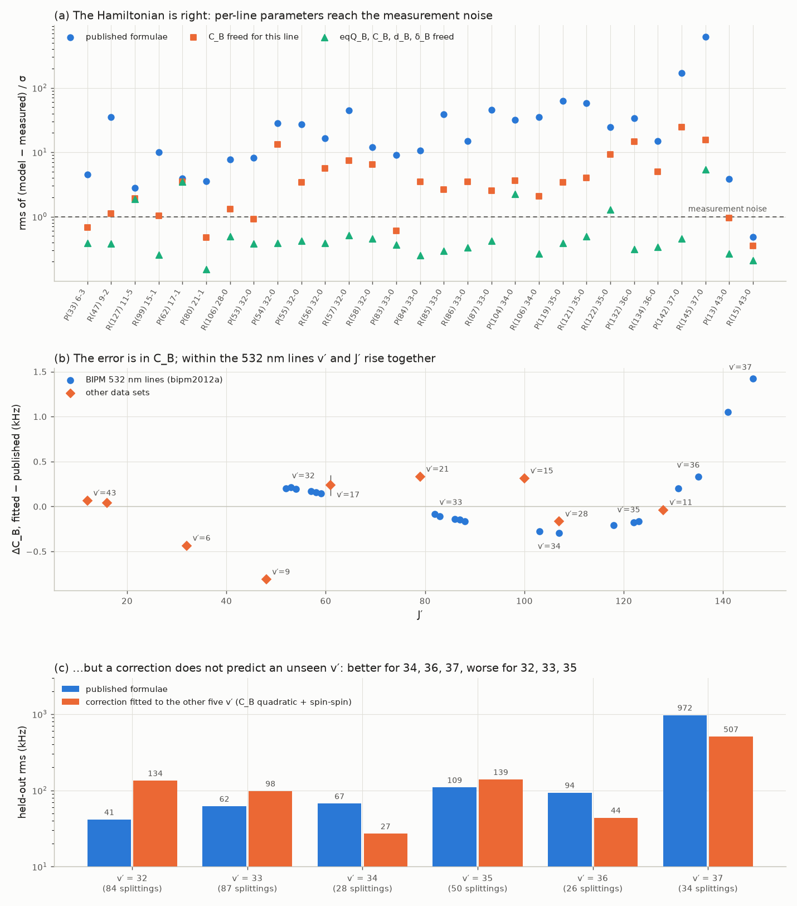
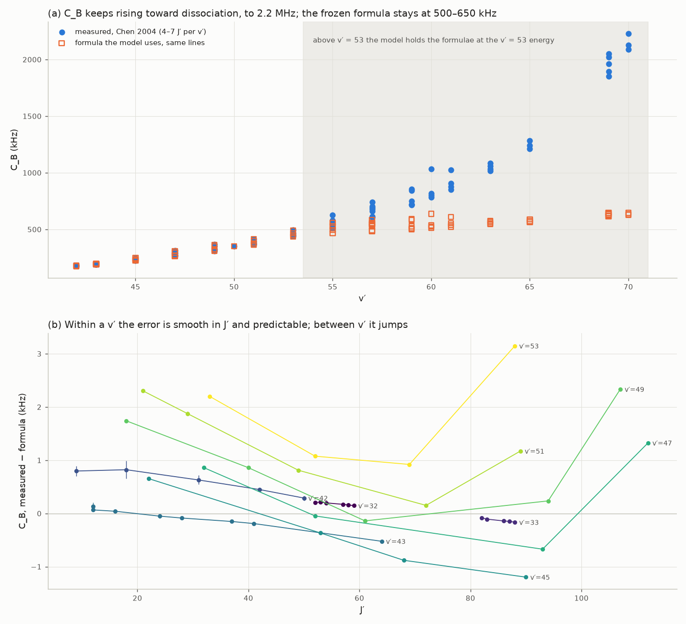

# The hyperfine refit (M5, Stage 2)

`src/i2spec/hyperfine_fit.py`. Holds the potentials fixed and asks whether the published hyperfine
parameter formulae — BKT02 (Bodermann, Knöckel & Tiemann 2002) for ¹²⁷I₂ at v′ ≤ 43, S06
(Salumbides et al. 2006) otherwise — can be improved against the splittings we hold.

**Result: not yet, and the model keeps the published formulae.** The fit established three things:

1. **The hyperfine Hamiltonian is right.** Freed line by line, the B-state parameters reproduce 25 of
   the 29 precisely measured lines to within 1.5× their measurement uncertainty. The published
   formulae manage 1 of 29.
2. **The error is mostly in C_B**, the B-state nuclear spin–rotation constant. It peaks at +1.42 kHz
   for R(145) 37-0, which puts that line 1.2 MHz out against 2 kHz measurements.
3. **No smooth global correction to the formulae predicts lines it has not seen.** The corrections fit the lines
   they are given, but they are worse than the published formulae on half the held-out v′ groups of
   the 532 nm lines, and far worse at v′ = 6–21.
4. **Chen 2004 (several J′ per v′) explains why.** The error is smooth in J′ within a v′ and
   predictable from the other lines there, to 0.03 kHz in C_B at v′ = 42–43, but it jumps from one v′
   to the next. The same data show that **above v′ = 53 the model's hyperfine parameters are
   qualitatively wrong**: C_B is 570 kHz rms too low, and the predicted hyperfine intervals are off by
   63 MHz (median), up to 470 MHz. See *Chen 2004* below.

Every number below comes from `prototypes/hyperfine_stage2.py` (30 s) and, for the Chen 2004 section,
`prototypes/hyperfine_chen2004.py` (1 min), which write their JSON to `prototypes/out/` and the figures.

## What it fits to

Only **intra-line splittings**: intervals between two hyperfine components of the same line. The
rovibronic centre cancels exactly, so they say nothing about the potentials, and Stage 1 discards
them. 642 splittings on 44 lines across 13 data sets; lines above v′ = 53 are skipped, since both
formulae stop there.

## What it varies

Additive corrections to the published parameters (`hfs_params.Corrections`). Each is a low-order
polynomial in s = (v + ½)/10 and y = J(J + 1)/10⁴, which are of order one over the data:

| parameter | terms |
|---|---|
| eqQ_B | 1, s, y |
| C_B | 1, s, s², y, sy, y² |
| d_B, δ_B | 1, s, y |
| eqQ_X, C_X | 1, s |

With every term zero the published formulae come back exactly (`test_zero_corrections_reproduce_the_published_formulae`).
Priors are half the 2σ figures of BKT02 §7: 25 kHz on eqQ, 1 kHz on C, 2 kHz on d, 1.5 kHz on δ.

## The first attempt, and why it failed

An 8-term fit (constants, plus a v term on eqQ_B and C_B) weighted by measurement uncertainty cut
χ²/n from 13 070 to 7 560. **The rms got worse, 503 → 767 kHz**, and so did every data set but one:
reinhardt2006a went from 122 to 925 kHz. eqQ_X ran 53σ from its prior.

The cause was one line. Weighted by measurement uncertainty, **R(145) 37-0 held 91% of χ²** (20 of
642 splittings), and P(142) 37-0 held another 4.7%. Those are 2 kHz measurements that the formulae
miss by 1.2 and 0.34 MHz. The fit spent all eight parameters on them.

The error there isn't noise. It's structured model error, which the per-line fits below show is 20×
to 600× larger than the measurement uncertainty. Two changes, both kept:

- **A model-error floor added in quadrature** (`MODEL_FLOOR`, 25 kHz). That is what the formulae achieve
  on their best line, R(56) 32-0, and the figure BKT02 quotes for it.
- **A robust loss** (`soft_l1`, f_scale = 3).

With both, the fit behaves: every term lands within ~2σ of its prior, at any f_scale from 1 to 5. It
also changes almost nothing (503 → 506–512 kHz), trading bipm2003b/d against reinhardt2007a and
bodermann1998b. That result led to the per-line test.

## The per-line test: is the Hamiltonian right?

`HyperfineFit.per_line_fit` frees eqQ_B, C_B, d_B and δ_B for one line at a time, weighted by
measurement uncertainty alone. The X-state parameters stay fixed, because within one line eqQ_X is
perfectly correlated with eqQ_B (ρ = 1.00), and C_X with C_B. Only the B state is identifiable.

The measure is rms((model − measured)/σ), which is 1 at the measurement noise. A kHz rms misleads
here: many tables mix 5 kHz and 1 MHz components within one line, and the kHz rms then reports only
the loose ones. That is why R(15) and P(13) 43-0 *look* 100–180 kHz out while their precise
components agree to 1–9 kHz.

For the 29 ¹²⁷I₂ lines measured to ≤ 25 kHz:

| | lines within 1.5σ | within 3σ |
|---|---|---|
| published formulae | 1 | 2 |
| C_B freed per line | 9 | 13 |
| eqQ_B, C_B, d_B, δ_B freed per line | **25** | **27** |

| line | published | C_B freed | four freed |
|---|---|---|---|
| R(145) 37-0 | 618σ | 15.7σ | 5.4σ |
| P(142) 37-0 | 169σ | 24.8σ | 0.45σ |
| R(47) 9-2 | 35σ | 1.1σ | 0.38σ |
| R(56) 32-0 (CIPM 532 nm) | 16.5σ | 5.7σ | 0.39σ |
| P(62) 17-1 | 3.9σ | 3.5σ | 3.5σ — see *Data conflict* |
| P(104) 34-0 | 32σ | 3.6σ | 2.3σ |
| R(127) 11-5 | 2.8σ | 1.9σ | 1.9σ |

Many four-parameter fits land at 0.3–0.5σ, so the BIPM uncertainties are conservative.

**C_B carries most of the error.** Freed alone, it takes R(145) 37-0 from 1235 kHz to 31 kHz. Each
line pins ΔC_B to ±0.001–0.03 kHz. It is a few tenths of a kHz either way through v′ = 6–35, then
+0.20 and +0.33 at v′ = 36 (J′ = 131, 135), then **+1.05 and +1.42 at v′ = 37 (J′ = 141, 146)**
(figure, panel b).

## Two explanations that failed

Both were zero-parameter tests, and neither survived:

- **S06's J-dependent spin–spin terms added to BKT02.** BKT02's d_B and δ_B (eqs. 12–13) depend on
  E(v′, J = 0) alone. S06 adds a (v + ½)²·J(J + 1) term to both perturber numerators, and a rough
  estimate gave the right size for the v′ = 32 → 37 change. In the full calculation, R(145) 37-0 only
  goes from 1235 to 1197 kHz; the overall rms goes from 503 to 500.
- **The C_B pole at the rotating level energy.** BKT02's C_B has −(110704 + 1.862·J(J+1))/(E_b − 19986)
  with E_b = E(v′, J = 0), and R(145) 37-0 sits at 19 680 cm⁻¹ with rotation, 306 cm⁻¹ from the pole.
  Using E(v′, J′) in the denominator makes every line worse, up to 71 MHz. This agrees with the finding
  in `docs/research/isotopologue-hyperfine.md` §8c that the formulae want E at J = 0.

## Cross-validation: does a correction predict?

`HyperfineFit.cross_validate` fits a set of terms to all but one group, predicts the held-out group,
and repeats. It works on a linearised Jacobian (`jacobian`, `linear_fit`), so a whole
cross-validation takes milliseconds. The linearisation is exact. It agrees with the full calculation
to < 0.01 kHz up to half a prior step on several terms at once, and to 0.1 kHz at every coefficient
set the cross-validation below produced. At a full prior step on three terms, C_B moves by ~6 kHz at
J′ = 146 and two components of R(145) 37-0 swap frequency order, which the rank matching reads as an
840 kHz jump (`test_the_linearised_problem_is_exact`).

Model error floor 5 kHz, for the 452 splittings measured to ≤ 25 kHz (¹²⁷I₂). The last column uses
the 25 kHz floor, to show the conclusion doesn't depend on it:

| terms | n | in-sample | held-out line | held-out (set, v′) | held-out line, 25 kHz floor |
|---|---|---|---|---|---|
| published | 0 | 279 | 279 | 279 | 279 |
| C_B linear | 3 | 192 | 325 | 385 | 316 |
| C_B quadratic | 6 | 99 | 182 | 253 | 203 |
| **C_B quadratic + spin–spin** | 12 | 93 | **176** | 248 | 196 |
| + eqQ_B | 15 | 91 | 181 | 252 | 198 |
| everything | 19 | 59 | 233 | 292 | 221 |
| spin–spin only | 6 | 259 | 313 | 330 | 300 |

(kHz rms.) The best held-out total, 176 kHz against 279, looks like a win. By data set it isn't:

| held-out line, kHz | published | C_B quadratic + spin–spin |
|---|---|---|
| bipm2012a (v′ = 32–37) | 330 | **101** |
| bipm2003a | 34 | 340 |
| bipm2003d | 189 | 300 |
| reinhardt2006a | 149 | 375 |
| bodermann1998b | 36 | 54 |
| bipm2003b | 41 | 53 |
| bipm2005a | 5 | 74 |
| bipm2003c | 114 | 109 |

bipm2012a is 309 of the 452 splittings, so it dominates the total. The correction learns v′ = 32–37 and
damages everything else.

A correction limited to the 532 nm region doesn't hold up either. Fitted to five of the six v′ groups
of bipm2012a and asked to predict the sixth (figure, panel c):

| held-out v′ | splittings | published | C_B quadratic | + spin–spin |
|---|---|---|---|---|
| 32 | 84 | **42** | 142 | 134 |
| 33 | 87 | **62** | 103 | 98 |
| 34 | 28 | 67 | 24 | **27** |
| 35 | 50 | **109** | 138 | 139 |
| 36 | 26 | 94 | 63 | **44** |
| 37 | 34 | 972 | 527 | **507** |

The fitted groups sit at 17–37 kHz while the held-out ones sit at 27–507 kHz. The correction fits
what it sees and can't predict a v′ it hasn't seen.

## Why the data can't fix the form

The 532 nm lines are six v′ groups, and each has a narrow J range that rises with v′: J′ ≈ 55 at
v′ = 32, up to ≈ 143 at v′ = 37. **v′ and J′ are confounded**, so no fit can tell a v′ dependence of
ΔC_B from a J′ dependence. The lines outside that region (v′ = 6–28) are single lines, scattered in
(v′, J′), and several are measured only to hundreds of kHz.

What would settle it: splittings at **several J′ within each v′**, especially low J′ at v′ = 35–37 and
high J′ at v′ = 32–33. Each line would add another ±0.01 kHz ΔC_B point. An alternative is the
per-level spin–rotation constants from a molecular-beam or sub-Doppler study, if one exists.

## Data conflict: P(62) 17-1

bipm2003c and reinhardt2006a measure the same intervals of P(62) 17-1, both at 20 kHz, and disagree:

| interval | bipm2003c − model | reinhardt2006a − model |
|---|---|---|
| a3 − a1 | +194 kHz | −17 kHz |
| a4 − a1 | −205 kHz | +29 kHz |

That is 7–8σ, equal and opposite on neighbouring components, which looks like an a3/a4 swap in one
source's labels or transcription. No per-line parameter set fits both, which is why this line stays
at 3.5σ. Unresolved: the two sources need rechecking against their page images.

## Chen 2004: several J′ per v′

`data/hyperfine_parameters/chen2004a` (74 lines; transcription in its `meta.toml`) gives eqQ_B, C_B, d_B
and δ_B fitted line by line at v′ = 42–70, with 4–7 J′ at most v′ (J′ ≈ 9–112). Chen held the X state at
BKT02, as i2spec does, so the values compare directly with the formulae and with `per_line_fit`. Where
they overlap, they agree: for P(13) 43-0, ΔC_B is +0.13 ± 0.08 kHz from Chen and +0.066 ± 0.005 kHz from
the bipm2005a splittings.

The lines fall into three regions by which formula the model uses. Together with the Stage 2 per-line
fits, there are 40 lines (v′ = 6–43) under BKT02, 23 (v′ = 45–53) under S06, and 40 (v′ = 55–70) above
v′ = 53, where `hfs_params` holds S06 at the v′ = 53 energy.

**Measured − formula, and how well it can be predicted.** Four predictors of a line's correction, each
scored on held-out lines. The lines scored are those with at least three others at the same v′:

- **published:** zero correction.
- **same v′, line / quadratic:** a fit in J′(J′+1) to the other lines at that v′.
- **neighbouring v′:** linear interpolation between the per-v′ fits of the nearest measured v′ on either
  side, with the line's own v′ left out. It needs a measured v′ on both sides, so it scores fewer lines
  (16, 14 and 30).

| region | parameter | lines | published | same v′, line | same v′, quadratic | neighbouring v′ |
|---|---|---|---|---|---|---|
| BKT02, v′ ≤ 43 | C_B (kHz) | 24 | 0.33 | **0.03** | 0.13 | 0.74 |
| | d_B (kHz) | 24 | 2.03 | 1.87 | 3.96 | 2.35 |
| | δ_B (kHz) | 24 | 2.95 | 3.00 | 9.77 | 4.87 |
| | eqQ_B (kHz) | 24 | 208 | 218 | 671 | 193 |
| S06, v′ 45–53 | C_B (kHz) | 22 | 1.39 | 1.56 | **0.15** | 0.78 |
| | d_B (kHz) | 22 | 7.54 | **2.67** | 5.08 | 3.20 |
| | δ_B (kHz) | 22 | 2.93 | 2.40 | 5.44 | 2.22 |
| | eqQ_B (kHz) | 22 | 113 | 99 | 192 | 95 |
| frozen, v′ ≥ 55 | C_B (kHz) | 34 | 572 | 13.3 | **5.0** | 30.5 |
| | d_B (kHz) | 34 | 223 | **50** | 110 | 68 |
| | δ_B (kHz) | 34 | 977 | **52** | 79 | 75 |
| | eqQ_B (kHz) | 34 | 3883 | **1117** | 4063 | 1206 |

What this says:

- **Within a v′, C_B's error is smooth in J′.** Under BKT02 it is a straight line in J′(J′+1) that
  predicts a held-out line to 0.03 kHz, 10× better than the formula. Under S06 it is curved (at
  v′ = 49 it runs +1.7, +0.9, −0.1, +0.2, +2.3 kHz over J′ = 18–107), and a quadratic predicts it to
  0.15 kHz.
- **Between v′ it jumps.** Interpolating from the neighbouring v′ is worse than the formula under BKT02
  (0.74 against 0.33 kHz), and between v′ = 42 and 43 ΔC_B changes by ~0.7 kHz at the same J′. That
  is the v′-by-v′ structure that stopped a smooth global correction from validating in Stage 2.
  The second-order sum over perturbing levels in Chen's eq. (4) would produce such structure, though
  that attribution is untested here.
- **d_B, δ_B and eqQ_B gain little under the formulae.** Quadratics overfit 3–5 points.
- **Above v′ = 53 anything measured beats the frozen formula.** C_B rises to 2.2 MHz at v′ = 70 while the
  frozen formula stays at 500–650 kHz. Even interpolating across v′ cuts the C_B error from 572 to 30 kHz.

**What it does to the predicted spectrum.** The same model computed each line's hyperfine intervals
twice: once with the formulae, once with Chen's four parameters.

| region | lines | intervals differ, rms (median) | range of rms | worst single interval |
|---|---|---|---|---|
| BKT02, v′ 42–43 | 11 | 0.10 MHz | 0.01–0.22 MHz | 0.33 MHz |
| S06, v′ 45–53 | 23 | 0.17 MHz | 0.04–1.5 MHz | 2.8 MHz, P(89) 53-0 |
| frozen, v′ 55–70 | 40 | **63 MHz** | 5.8–374 MHz | **470 MHz**, P(53) 69-0 |

On patterns 0.85–1.35 GHz wide, the model's hyperfine structure above v′ = 53 is not a small error.
This covers the 500–510 nm region. Two caveats:
- The default B grid stops at v′ = 59 (`DEFAULT_GRIDS`), so v′ = 60–70 needs the larger grid the
  prototype uses.
- Positions there are already flagged as unreliable, but the component patterns were not.

**What would fix it.** Per-v′ tables of measured parameters, applied at the measured v′:
- a straight line in J′(J′+1) for C_B under BKT02, and a quadratic under S06 and above;
- straight lines for d_B and δ_B;
- the published eqQ_B except above v′ = 53.

The cross-validation above is the evidence that this predicts held-out J′ at those v′. At unmeasured
v′ ≥ 55, interpolating between measured v′ is still 20× better than the frozen formula. At unmeasured
v′ ≤ 53 the formulae remain the best choice. This is not yet implemented.

## The table from every set (i2spec2026n)

The shipped table was built from 14 sets named in the script. The 29 sets transcribed afterwards, many of
them 532 nm hyperfine studies, were never in it. `prototypes/hfs_measured_table.py --all` now reads every
set in use through `observations.load_all`, so compilations give way to their sources and each
measurement enters once. That gives 156 lines at 45 values of v′ from 31 sources, against 124 at 36 from 12.
The table is named by the parameter set (`"hyperfine_table": "b_state_lines_2026n"` in `i2spec2026n`), so
earlier sets keep the table they were validated with.

`prototypes/hfs_table_cv.py` predicts every ¹²⁷I₂ intra-line splitting three ways: from the formulae
alone, and from the old and new tables each rebuilt without the line being predicted
(`HyperfineTable(rows, exclude=...)`). Lines in neither table use the full tables, as the model does.
Scored against the stated σ:

| | splittings | formulae | old table | new table |
|---|---|---|---|---|
| all, within 1σ / 3σ | 1 446 | 11 / 21 % | 18 / 40 % | **26 / 52 %** |
| σ ≤ 25 kHz, within 1σ / 3σ | 1 295 | 5 / 13 % | 13 / 34 % | **22 / 47 %** |

| set, held out | old table: within 1σ, rms | new table |
|---|---|---|
| simonsen2000a (633 nm, v′ = 6–11) | 4 %, 146 kHz | **37 %, 9.4 kHz** |
| sakagami2020a (531.5 nm) | 10 %, 21.9 kHz | **38 %, 11.4 kHz** |
| tanabe2022a (556 nm) | 2 %, 54.6 kHz | **35 %, 30.0 kHz** |
| edwards1999a (633 nm) | 10 %, 40.0 kHz | **80 %, 7.0 kHz** |
| arie1994a | 0 %, 23.7 kHz | **20 %, 9.4 kHz** |
| bipm2003a | 26 %, 69.8 kHz | **49 %, 63.4 kHz** |
| hong2001a | 41 %, 4.3 kHz | 18 %, 4.3 kHz |
| hong2000a (within 3σ) | 39 %, 2.9 kHz | 25 %, 3.6 kHz |

Three Hong et al. sets lose a little, at the 1–4 kHz level, where each new line changes the
correction at its v′. No set gets worse by more than a kHz rms. The sets that stay far out held-out
(kobayashi2016a 282, matsunaga2024a 334, hong2002a 190 kHz rms) are the v′-to-v′ steps that
no table can predict at a v′ without its own lines.

## What is kept

- `MODEL_FLOOR`, the robust loss, the `free` subset, and a true rms instead of `std()` (the first
  version's report subtracted the mean).
- `per_line_fit`, `jacobian`, `linear_fit`, `cross_validate` and `groups`.
- `Corrections` with the polynomial basis above; zero is exactly the published model, and nothing in
  the package applies a non-zero one.
- `tests/test_hyperfine_fit.py`; for Chen 2004, `tests/test_hyperfine_parameters.py`.

## Open

- Resolve P(62) 17-1 between bipm2003c and reinhardt2006a.
- ~~Per-v′ parameter tables~~ — done, above. Every new precise line extends the table: rerun
  `prototypes/hfs_measured_table.py --all --out=<new name>`, check it with `prototypes/hfs_table_cv.py`,
  and name it in a new parameter set.
- The default B grid stops at v′ = 59 while Chen measures to v′ = 70.
- A global correction should still ship only when it beats the published formulae on held-out groups
  in every data set, not just in total.
