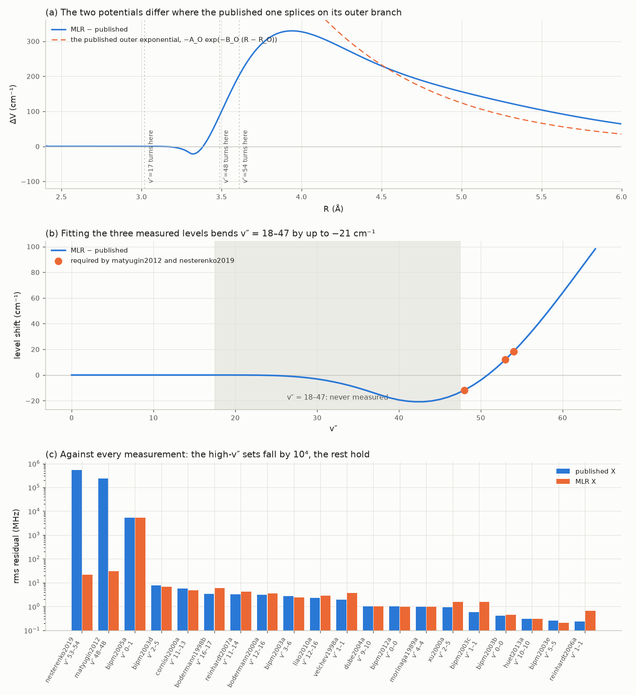

# An MLR X potential (M5, Phase C trial)

`src/i2spec/potentials.py` (`MLRPotential`), `prototypes/mlr_x.py`, `data/potentials/mlr_x_2026a.json`.

**Result: the published X potential's high-v″ failure is its functional form, not a conflict in the
data.** A Morse/Long-Range potential fits the v″ ≤ 17 levels *and* the measured v″ = 48, 53 and 54
levels at once, with De, C₆, C₈ and C₁₀ left exactly at their published values. The shipped model
still uses `hannover2008`; this is a research result, and the caveats at the end are real.



## The problem this addresses

From `docs/design/fitting.md`: the published X potential is within 4 MHz of every measurement up to
v″ = 17, and then

- +7.8 cm⁻¹ at v″ = 48 (`matyugin2012`),
- −14.6 and −21.1 cm⁻¹ at v″ = 53 and 54 (`nesterenko2019`),

with nothing measured between v″ = 18 and 47. The Stage 1 fit could not repair this. Every smooth
handle it has — the join radius R_O, De, the dispersion coefficients — moves v″ = 48, 53 and 54 the
same way, and here one must go down while the others go up. That looked like a contradiction in the
data. It was not.

## What an MLR is, and why it is the natural fix

A Morse/Long-Range potential (Le Roy & Henderson 2007) is written as a Morse function whose exponent
is a *function* of R:

    V(R) = De [1 − u(R)/u(Re) · exp(−β(R) y_p^eq(R))]²,   y_n^r(R) = (R^n − r^n)/(R^n + r^n)

with u(R) = Σ C_n/R^n the theoretical long-range function, and

    β(R) = y_p^ref β_∞ + (1 − y_p^ref) Σ_i β_i (y_q^ref)^i,   β_∞ = ln(2 De / u(Re)).

The variables y are −1 at R = 0, 0 at the reference distance, and → 1 as R → ∞, so β(R) slides from a
free polynomial near the well to the fixed value β_∞ far out. That one construction is the whole
point:

- **V(Re) = 0 exactly**, whatever the β_i are.
- **V(R) → De − u(R) + u(R)²/4De exactly**, whatever the β_i are.

So the long-range tail is *theory*, not a fitted extrapolation, and the shape parameters cannot
corrupt it. `tests/test_mlr.py` asserts both limits for several unrelated β sets.

Contrast the published X-representation form: a power series in ξ = (R − Rm)/(R + b·Rm) for
2.4 ≤ R ≤ 3.3 Å, spliced at R_O = 3.3 Å onto De − ΣC_n/Rⁿ − A_O exp(−B_O(R − R_O)). That last
exponential is the seam. With the published A_O = 1054 cm⁻¹ and B_O = 1.26 Å⁻¹ it decays over 0.8 Å,
so it is still −232 cm⁻¹ at 4.5 Å — a large, physically unmotivated term sitting exactly where the
high-v″ levels turn (figure, panel a). Nothing in the fitted data constrains it, because the data
stop at v″ = 17, whose outer turning point is 3.02 Å.

## The fit

Targets:

| what | how many | weight |
|---|---|---|
| X levels v″ = 0–17 at J = 0, 40, 80, 120, 160, from `hannover2008` | 90 | 3 MHz each |
| X levels implied by `matyugin2012` (v″ = 48) and `nesterenko2019` (v″ = 53, 54) | 10 | 90 MHz each |
| De, C₆, C₈, C₁₀ priors (Knöckel 2004, via `docs/design/fitting.md`) | 4 | 0.128 cm⁻¹, 0.12e6, 1.20e7, 0.5e8 |

The measured X levels come from the observations directly: E_X(v″, J″) = E_B(v′, J′) − ν, using the
published B levels, which are anchored at v′ = 32–33 by the BIPM 532 nm tables. Ten distinct levels
result, internally consistent across their hyperfine components to 26–45 MHz.

Free parameters: 12 β coefficients, De, Re, C₆, C₈, C₁₀ — 17 in all, with p = 5, q = 3 and
R_ref = Re. The Jacobian is analytic by Hellmann–Feynman, ∂E/∂θ = ⟨ψ|∂V/∂θ|ψ⟩ with ∂V/∂θ taken on the
quadrature grid, so one eigensolve per J gives every derivative; that is what makes the fit take
minutes instead of hours. The measured levels are walked in from a 10 cm⁻¹ weight down to their real
one, and De is held at its published value until the last stage.

## What came out

| | published X | MLR |
|---|---|---|
| v″ ≤ 17 levels (against `hannover2008`) | — | 1.60 MHz rms, max 6.27 MHz |
| measured v″ = 48, 53, 54 | 7.8–21.1 cm⁻¹ out | **0.0007 cm⁻¹ rms**, max 0.0012 |
| De | 12 547.34 | 12 547.34 (0.0σ) |
| C₆, C₈, C₁₀ | 1.480e6, 3.86e7, 1.00e8 | unchanged, all 0.0σ |

**Against every measurement we hold** (`prototypes/mlr_x.py`, figure panel c; rms in MHz):

| data set | v″ | n | published | MLR |
|---|---|---|---|---|
| `nesterenko2019` | 53–54 | 18 | 544 836.5 | **21.5** |
| `matyugin2012` | 48 | 18 | 233 738.4 | **29.9** |
| `bipm2005a` | 0–1 | 57 | 5 431.3 | 5 431.5 |
| `bipm2003d` | 2–5 | 90 | 7.7 | 6.9 |
| `bodermann1998b` | 16–17 | 4 | 3.4 | 5.9 |
| `velchev1998a` | 1 | 115 | 2.0 | 3.7 |
| `xu2000a` | 2–5 | 473 | 0.9 | 1.5 |
| `bipm2012a` | 0 | 329 | 1.0 | 1.0 |
| `reinhardt2006a` | 1 | 57 | 0.2 | 0.7 |

Over all 1546 observations the rms falls from **64 MHz to 1 MHz**. `bipm2005a` does not move because
its 5.4 GHz is R(98) 58-1, a B-state failure at v′ = 58 that an X refit cannot touch.

The low-v″ sets that get worse (velchev1998a 2.0 → 3.7 MHz, reinhardt2006a 0.2 → 0.7) are not a
property of the form. They are there because the fit above used the *published levels* as its low-v″
target rather than the measurements themselves, so the MLR inherits the published errors and adds its
own 1.6 MHz of representation error. Fitting the MLR directly to the observations is the obvious next
step and should remove them.

## Refitting to the measurements

`prototypes/mlr_x_refit.py` redoes the fit against the data themselves: the 765 observations that
constrain the potentials — every frequency and every interval between *different* lines, ¹²⁷I₂ only —
with the B state, the hyperfine constants and each line's hyperfine offset held fixed. Lines above
v′ = 44 are dropped, because the published B potential is out by up to 2.2 cm⁻¹ there and an X-only fit
would bend X to absorb it. Each measurement uncertainty gets a 0.5 MHz floor, so the 5 kHz BIPM rows
cannot set the whole fit, and the loss is `soft_l1`. The result is `data/potentials/mlr_x_2026b.json`.

| rms on the same 765 rows | published X | MLR (levels) | MLR (refit) |
|---|---|---|---|
| all | 90 940 MHz | 6.10 | **4.37** |
| excluding `nesterenko2019` and `matyugin2012` (729 rows) | 1.640 | — | 1.813 |
| `nesterenko2019` (v″ 53–54) | 544 836 | 21.5 | 20.6 |
| `matyugin2012` (v″ 48) | 233 738 | 29.9 | **15.9** |
| `bodermann1998b` (v″ 16–17) | 3.9 | 6.8 | **1.9** |
| `liao2010a` (v″ 12–16) | 2.3 | 2.8 | **1.4** |
| `bipm2003b` (v″ 0) | 0.57 | 0.60 | 1.45 |

So on the precision data the MLR is now level with the published potential — 1.81 MHz against 1.64 on
the 729 rows that do not involve v″ ≥ 48 — while being four orders of magnitude better on the rest.
Individual sets move both ways: `bodermann1998b` and `liao2010a` improve by 2×, `bipm2003b` and
`xu2000a` get worse by about the same. Closing that last gap needs the B state fitted at the same
time, which is Stage 1's job, not this trial's.

What is left at v″ = 48–54, 16–21 MHz, is about the size of the hyperfine model's own error there: the
components of one line imply X levels that differ among themselves by 26–45 MHz.

**The refit does not change the prediction below.** Its level shifts agree with `mlr_x_2026a` to under
0.002 cm⁻¹ everywhere in v″ = 18–60, so the fit was already determined by the physics rather than by
the choice of low-v″ target.

## The prediction in the gap

Fitting the three measured levels bends the unmeasured region (figure, panel b). Level shifts, MLR
minus published, at J = 0:

| v″ | 17 | 25 | 30 | 35 | 40 | 42 | 45 | 48 | 50 | 53 | 54 | 60 |
|---|---|---|---|---|---|---|---|---|---|---|---|---|
| cm⁻¹ | −0.00 | −0.44 | −3.10 | −10.03 | −19.39 | **−20.81** | −18.97 | −11.76 | −3.93 | +11.99 | +18.32 | +64.08 |

So the published potential is predicted to be about **21 cm⁻¹ too high around v″ = 42**, in a region
where nothing has ever been measured. Two independent checks say this is not an artefact of the fit:

- a 10-term exponent instead of 12 agrees to **0.04 cm⁻¹** across the gap;
- moving the reference distance from R_ref = Rₑ = 2.666 Å to 1.25 Rₑ = 3.333 Å, which changes the
  meaning of every exponent coefficient, agrees to **0.002 cm⁻¹** across the gap.

**Above the highest measured level the fits part company.** At v″ = 58 and 60 the R_ref = Rₑ and
R_ref = 1.25 Rₑ solutions differ by 118 and 113 cm⁻¹. So the prediction is worth something up to
v″ = 54, where the data stop, and nothing beyond it. (An earlier version of this file quoted 0.36 cm⁻¹
at v″ = 60 from the 10- versus 12-term pair; those two shared a reference distance, so that number
understated the spread.)

**This is a prediction, not a validation.** The Gerstenkorn 11 000–14 000 cm⁻¹ atlas, now in hand,
reaches v″ = 25 at its tabulated density, not v″ = 42, and the 14 000–15 600 cm⁻¹ volume only
v″ = 4–10 (`docs/research/orsay-atlas-11000-14000.md`). Plate 1 already favours this MLR over the
published potential on 64 lines; nothing available tests v″ = 42 directly.

## Caveats

- **The optimiser is fragile.** Of seven settings tried, three converged to this solution (10 and 12 β
  terms at R_ref = Rₑ, and 12 at R_ref = 1.25 Rₑ, all agreeing) and four fell into local minima with De
  or Rₑ pinned at a bound — 14 β terms, p = 6/q = 4, and R_ref = 1.5 Rₑ. The existence of a good
  solution is the result; the path to it needs multi-start before this becomes the shipped model.
- **The β coefficients are ill-conditioned**, running to ±900 at high order with R_ref = Rₑ.
  R_ref = 1.25 Rₑ fits equally well and is the better-conditioned choice; for the **B** state the
  difference is not cosmetic but decisive — see below.
- **Low-v″ targets are the published levels, not measurements** (see above).
- **No damping functions.** Damped dispersion terms matter at small R, far inside where any of our
  data reaches, but they are part of the standard modern form and are not implemented.
- **The B state is untouched.** Its own 2.2 cm⁻¹ failure above v′ = 44 is a separate job, started
  below.
- **Born–Oppenheimer corrections** are taken unchanged from the published X potential, so the
  isotopologues are not re-examined here.

## Reproducing

```
uv run --with matplotlib python prototypes/mlr_x.py       # loads the fit, checks it, draws the figure
```

```
uv run python prototypes/mlr_x_fit.py 12 5 3              # redoes the fit itself, about 4 minutes
uv run python prototypes/mlr_x_refit.py                   # refits to the observations, about 7 minutes
```

The fitted parameters are in `data/potentials/mlr_x_2026a.json`, with their provenance. The fitting
script derives its measured X levels from the observations itself, so the two scripts share no state.

## The reference distance, and the B state

Fitting an MLR to the **B** state exposed something the X fits had hidden. With R_ref = Rₑ, a plain
least-squares fit of the MLR to the published B curve gives levels that are 188 cm⁻¹ out, or
numerically unstable. With R_ref = 1.25 Rₑ or 1.5 Rₑ, *the same fit* lands within 0.04–0.24 cm⁻¹:

| p, q | R_ref | β terms | curve rms | levels v′ ≤ 44, rms |
|---|---|---|---|---|
| 6, 4 | Rₑ | 10 | 0.72 cm⁻¹ | 188 cm⁻¹ |
| 6, 4 | Rₑ | 14 | 0.50 | unstable |
| 6, 4 | 1.25 Rₑ | 10 | 0.64 | **0.24** |
| 6, 4 | 1.25 Rₑ | 18 | 0.26 | **0.044** |
| 6, 3 | 1.5 Rₑ | 10 | 0.60 | **0.12** |

R_ref > Rₑ is Le Roy's standard advice, and this is why: with R_ref = Rₑ the switching variable
y_q^ref is still near zero across the whole well, so the exponent polynomial is being asked to do its
work in a variable that barely moves, and its coefficients grow until the fit is ill-conditioned. The
X state tolerated it; the B state, shallow (4381 cm⁻¹) with a long outer branch and a C₅ term, does not.

B also needs p > 5, since its long-range function spans C₅ to C₁₀.

### A B-state MLR (`data/potentials/mlr_b_2026a.json`)

`prototypes/mlr_b_fit.py` fits a 14-term B MLR (p = 6, q = 4, R_ref = 1.5 Rₑ) to the published B levels
for v′ ≤ 44 and to the 15 levels above v′ = 44 that the Salami & Ross band shifts imply, with the atlas
weight walked in from 1 cm⁻¹ to 0.005. Te + De is tied to De(X) + 7602.9762 cm⁻¹, the atomic splitting.

| against the atlas, v′ = 45–62 (15 levels) | published B | MLR B |
|---|---|---|
| rms | 1.375 cm⁻¹ | **0.019 cm⁻¹** |
| worst | 2.258 cm⁻¹ (v′ = 54) | 0.037 cm⁻¹ |

C₅, C₆, C₈ and C₁₀ stayed at their published values (C₅ 3.160e5 against 3.161e5). So the B state's
2.2 cm⁻¹ failure above v′ = 44 is the same story as the X state's: a form whose outer branch is free
where the data stop.

**What it costs:** this B reproduces the published levels below v′ = 45 only to 204 MHz rms (2.8 GHz
worst). Those levels are anchored to MHz by the BIPM tables at v′ = 32–35, so that is not good enough —
it is the joint fit's job to hold both ends, and it does not yet.

### The joint fit is not finished

`prototypes/mlr_joint_fit.py` fits both states to the 866 constraints — every ¹²⁷I₂ frequency and
inter-line interval, plus the atlas band shifts — with the hyperfine and Born-Oppenheimer terms fixed.
The machinery is right: the Hellmann–Feynman Jacobian agrees with finite differences to 1 part in 10⁴
on every parameter tested, and individual data sets improve a lot (`bodermann1998b` 108 → 6.9 MHz,
`liao2010a` 68 → 4.4, `bipm2003b` 4.6 → 0.29, `matyugin2012` 86 → 12). But the total gets worse,
100 → 166 MHz, because the atlas rows degrade (246 → 479 MHz) while the precision rows improve.

The first cause was the weighting, the same mistake Stage 2 made: the measurements span 5 kHz to
150 MHz in stated precision while the model's own error is tens of MHz, so `soft_l1` with
f_scale = 3 MHz capped the gradient from every row above a few MHz. The fit now carries a model-error
floor in quadrature that walks down from 50 to 0.5 MHz, exactly as `hyperfine_fit.MODEL_FLOOR` does.

**With that, and the five new kHz-level sets (989 constraints), it still does not converge.** Two
passes of 100 and 180 iterations from the separate fits' end points (2026-09-18):

| set | published X+B | start (separate fits) | pass 1 | pass 2 |
|---|---|---|---|---|
| `bipm2012a` (20 inter-line rows) | 3.8 | 98 | 90 | 87 |
| `nishiyama2024a` (v′ 39) | 5.5 | 161 | 4.9 | 6.9 |
| `yoshiki2023a` (v′ 44) | 38 | 93 | 115 | 110 |
| `matsunaga2024a` (v′ 45–50) | 300–53 000 | 831 | 213 | 199 |
| `bipm2005a` (v′ 43, 58) | 24 000 | 625 | 98 | 94 |
| `velchev1998a` | 2.0 | 29 | 40 | 40 |
| `xu2000a` | 0.9 | 19 | 18 | 19 |
| atlas bands | 246 | 246 | 337 | 355 |

(rms, MHz; "published" is the error-budget baseline on the same rows.) The high-v′ sets improve by one
to three orders of magnitude and the precision sets get ten times worse than the published model, and
pass 2 changes almost nothing: 180 iterations for 3 MHz on `bipm2012a`. That is an optimiser stalled in
a stiff, ill-conditioned landscape — 40 parameters, exponent coefficients of ±900, one trust region —
not a shortage of data or of representability (each state fits its own data to MHz on its own).

Holding X and fitting B alone from the same point (`--b-only`, 180 iterations) moves nothing either:
`bipm2012a` 90 → 89 MHz. So the stall is not the coupling of the two states.

**The stall is the start, and the start is the published B.** Every B MLR above was initialised by
fitting the *published* B levels, which a 14-term exponent reproduces to only 40–200 MHz rms, and the
joint fit could never climb out of that. Fitted instead to *measured* B levels — every ¹²⁷I₂ absolute
frequency with v″ ≤ 17, its X level taken from the MLR X and its hyperfine offset frozen, 787 of
them, plus the published levels at 3 MHz for v′ ≤ 30 as shape guidance and the 15 atlas bands
(`prototypes/mlr_b_levels.py`) — the same 14-term MLR converges in minutes:

| B levels | rms |
|---|---|
| measured, v′ ≤ 30 (comb-referenced) | **1.7 MHz** |
| measured, v′ = 31–44 | 6.7 MHz |
| measured, v′ = 45–50 (Yoshiki, Matsunaga) | 17 MHz |
| atlas bands, v′ = 45–62 | 0.029 cm⁻¹ (published: 2.2) |

So the MLR can represent the B state that the *data* describe; what it could not follow was the
published curve. That is worth knowing on its own: the 32-term ξ-series B has structure the
measurements do not, and any fit started from it inherits that structure as a 40–200 MHz handicap.
This B is `data/potentials/mlr_b_2026b.json`. With the MLR X, against every observation that constrains a
position (`prototypes/mlr_evaluate.py`; rms, MHz):

| set | v′ | published | MLR X + B |
|---|---|---|---|
| `nesterenko2019` | 32 (v″ 53–54) | 544 836 | **25.8** |
| `matyugin2012` | 32–33 (v″ 48) | 233 738 | **23.9** |
| `matsunaga2024a` | 45–50 | 24 905 | **17.7** |
| `bipm2005a` | 43, 58 | 23 662 | 2 071 |
| `yoshiki2023a` | 44–45 | 119 | **4.4** |
| `nishiyama2024a` | 39 | 5.6 | **1.2** |
| `bodermann1998b` | 0 (v″ 16–17) | 3.9 | **1.4** |
| `liao2010a` | 0 | 2.3 | **1.2** |
| `bipm2003d` | 9–15 | 3.2 | 2.3 |
| `sansonetti1997a` | 5–22 | 1.6 | 1.2 |
| `xu2000a` | 5–13 | 0.94 | 1.3 |
| `velchev1998a` | 13–18 | 2.0 | 2.5 |
| `bipm2003a` | 6–12 | 1.1 | 3.2 |
| `bipm2003b` | 26–28 | 0.57 | 1.4 |
| `bipm2012a` (inter-line intervals) | 32–37 | 3.9 | **26.6** |
| all 1013 rows | | 79 062 | 113 |

Within about a factor of two of the published model on its own ground, better on some of it, and two
to four orders of magnitude better wherever the published potentials extrapolated. The one clear
regression is the twenty BIPM 532 nm intervals between lines, 3.9 → 26.6 MHz: they were not among the
fitted levels (only absolute frequencies were converted to levels), and relative errors of 25 MHz
between v′ = 32 and 33–37 cost nothing in the fit. Turning each interval into an absolute level through
the 5 kHz R(56) 32-0 a10 reference is the next step, and a small one. It is not the default until that
is done and the ship rule of `docs/design/hyperfine-fit.md` is met on every set.


### Adopted for the extended range (2026-09-19)

`i2spec2026d` uses this pair for every X level from v″ = 18 and every B level from v′ = 44 up, with
measured level corrections on top; below, the published curves stay (`parameter-sets.md`, "Why a
hybrid"). The ship rule the pair could not meet inside the published range — better or equal on every
set — is not asked of it there any more, and beyond that range it is uncontested.

### The alternating fit (`mlr_x_2026c`, `mlr_b_2026c`)

Folding the inter-line intervals in as absolute frequencies through their reference components — the
BIPM 532 nm lines through R(56) 32-0 a10, R(98) 58-1 through P(13) 43-0 a3 — then one X pass
(`prototypes/mlr_x_levels.py`) and one more B pass gives the pair in `data/potentials/*_2026c.json`.
The B pass carries a 300 MHz floor above v′ = 50: forced through R(98) 58-1 at its 5 kHz, the B bent
elsewhere (`nishiyama2024a` 1.2 → 22 MHz), and that line and the atlas bands disagree by about 1 cm⁻¹
about where v′ = 58 sits at J′ = 99 versus J′ ≈ 26 — the J-dependent shift a 1g crossing produces,
which Chen 2004 sees at v′ = 57–60 and which a single-channel potential should not be made to follow.

B levels after the third pass: 2.3 MHz rms at v′ ≤ 30, 3.7 at 31–44, 12 at 45–50, atlas 0.029 cm⁻¹.
Against every observation (rms, MHz):

| set | v′ | published | 2026c pair |
|---|---|---|---|
| `nesterenko2019` | 32 (v″ 53–54) | 544 836 | **18.3** |
| `matyugin2012` | 32–33 (v″ 48) | 233 738 | **6.6** |
| `matsunaga2024a` | 45–50 | 24 905 | **12.5** |
| `bipm2005a` | 43, 58 | 23 662 | 1 883 (v′ = 58 released) |
| `yoshiki2023a` | 44–45 | 119 | **3.3** |
| `nishiyama2024a` | 39 | 5.6 | **3.2** |
| `bipm2012a` (intervals) | 32–37 | 3.9 | 4.6 |
| `bodermann1998b` / `liao2010a` | 0 | 3.9 / 2.3 | **1.6 / 1.0** |
| `xu2000a` / `velchev1998a` | 5–18 | 0.94 / 2.0 | 1.8 / 3.5 |
| `bipm2003a` / `bipm2003b` | 6–28 | 1.1 / 0.57 | 4.2 / 2.2 |
| `sansonetti1997a` / `kobayashi2016a` | 5–22 | 1.6 / 2.1 | 2.1 / 3.6 |
| all 1013 rows | | 79 062 | 103 |

**Verdict against the ship rule: not yet.** Better on nine sets, by up to four orders of magnitude, and
worse on thirteen, by 1.1–4×. The pair's error is spread at 2–4 MHz over the whole measured range
where the published model is at 0.5–1 MHz below v′ = 30 and useless above v′ = 44. Whether the last
factor of two to four at low v′ is the 14-term B exponent's room or the 1 MHz floors is the next
question; more terms and one more alternation are the way to ask it, at about an hour a cycle.

Still open after that: the atlas bands at v′ = 54–62 and the measured levels at v′ ≤ 50 pull the
14-term B in different directions (the atlas ends 0.029 cm⁻¹ off once the measured levels are at
their weight). Whether that is the exponent wanting more terms beyond v′ = 50, or the 1g-state
perturbation Chen 2004 sees at v′ = 57–60 moving those levels, needs kHz data above v′ = 50 to say.
