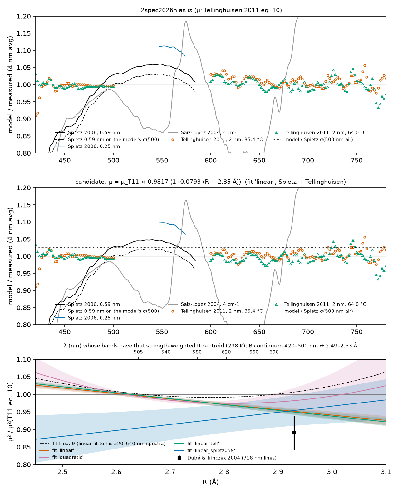

# Is the discrete B←X band strength too high at 500–630 nm?

*2026-09-30. Script: `prototypes/bx_tdm_check.py`. Output: `prototypes/out/bx_tdm_check.json` and `docs/figures/bx_tdm_check.png`. Model: `i2spec2026n`, with the line list and continuum of `paper/figures/fig9_xsec.py`. The data and their conditions are described in `cross-section-data.md` and `data/external/README.md`. Follows up on `tellinghuisen-components.md`.*

## Summary

* **Most of the reported 3–10 % is not a band-strength error.**
  * About 3 % of it comes from the 500 nm anchor. The model reproduces Tellinghuisen's σ(500 nm) to −0.15 %. Spietz's σ(500 nm) is 3.0 % lower, and both Spietz spectra are pinned to it.
  * A further 5–6 % in the Spietz 0.25 nm spectrum is that spectrum's disagreement with the Spietz 0.59 nm spectrum.
  * Saiz-Lopez 2004 cannot be used for this.
* **What remains is small, and it has two different shapes.**
  * Against Tellinghuisen's measured spectra at 600–628 nm the model is +2.6 % (35.4 °C) and +1.4 % (64.0 °C), once his effective resolution is matched.
  * Against Spietz 0.59 nm, put on the model's own σ(500), it is +1 to +3 % at 510–560 nm, 0 at 570–580 nm and −2 % at 580–588 nm.
  * These two data sets do not overlap in wavelength. Where each one has data, it asks for an opposite slope of the moment.
* **Optical depth could explain all of the Tellinghuisen excess, but his I₂ column is not known.** A column of about 7 × 10¹⁶ cm⁻² would do it; that is an absorbance of 0.07 at 500 nm. Under 1 bar of bath gas (Spietz, Saiz-Lopez), optical depth changes the band means by ≤ 0.5 % and ≤ 1.9 %.
* **The smallest moment change that fits both data sets** (Tellinghuisen carries most of the weight) is:
  * μ(R) = μ_T11(R) · g · [1 + a (R − 2.85 Å)], with g = 0.9817(36) and a = −0.079(15) Å⁻¹.
  * In μ² that is +1.0 % at 2.55 Å, −1.3 % at 2.70 Å, −2.9 % at 2.80 Å and −4.9 % at 2.93 Å.
* **Recommendation: do not put it in a new parameter set yet.** The case for it rests on one data set whose column is unknown, and the independent data (Spietz) do not support its wavelength dependence (details in the last section).

## 1. What was compared, and how

* **Model.** Every B–X line of the default list (1 081 490 lines; S ≥ 10⁻²⁷ cm somewhere in 200–600 K), plus the A←X, C←X and B←X continua. The model is taken at each data set's temperature. It is averaged over a Gaussian instrument function of the set's FWHM in the weak-absorption limit and then multiplied by an optical-depth factor F = σ_app(N)/σ_weak. F comes from the full line-by-line −ln(ILS ⊗ e^(−σN))/N at the set's column:
  * Voigt lines with a 0.24 cm⁻¹ Lorentzian for 1 bar of N₂ or air;
  * pure Doppler with hyperfine structure for Tellinghuisen's pure-vapour cells.
* **Comparison.** Ratios of 10 nm bin means of model and data at the data's own sampling points. The figure uses 4 nm Gaussian smooths.
* **Moment changes, computed exactly without rebuilding the list.**
  * Lines: for every line, M_k = ⟨v′J′|μ_T11 (R − 2.85)^k|v″J″⟩ (k = 0, 1, 2) from the DVR eigenvectors the line list uses. M₀ reproduces `strength0` to 6 × 10⁻¹³. For any μ·g(1 + a z + b z²), S = S₀ g² (1 + a M₁/M₀ + b M₂/M₀)², where z = R − 2.85 Å. A direct rebuild with the corrected μ agrees to 1 × 10⁻¹⁴.
  * The B←X continuum, which uses the same μ: six `continuum_model` builds with μ multiplied by 1, 1 ± z, 1 ± z² and 1 + z + z². They give the six products of matrix elements, so the continuum is exact in (g, a, b) too. The builds patch `i2spec.continuum.mu_tellinghuisen2011` inside the script only.
  * A←X and C←X are left unchanged.
* **Where each wavelength samples the moment.** R-centroids ⟨μR⟩/⟨μ⟩, strength-weighted, at 298 K:

| λ (nm) | 505 | 525 | 545 | 565 | 585 | 605 | 625 | 645 | 665 | 695 |
|---|---|---|---|---|---|---|---|---|---|---|
| R̄ (Å) | 2.641 | 2.670 | 2.700 | 2.729 | 2.757 | 2.784 | 2.811 | 2.836 | 2.862 | 2.899 |

  * The B←X continuum samples 2.49 Å at 420 nm, 2.55 Å at 450 nm and 2.63 Å at 500 nm.
  * So the 540–630 nm bands sample R ≈ 2.69–2.82 Å, not the 2.8–2.95 Å suggested in `tellinghuisen-components.md`. Only the red hot bands (650–700 nm, where B lines are ≤ 20 % of σ) and the Dubé 718 nm lines reach 2.85–2.93 Å.

## 2. The excess, per data set (i2spec2026n as is)

| Data set | Range (nm) | Model / data | Notes |
|---|---|---|---|
| Spietz 0.59 nm, 298 K, 1.42 × 10¹⁶ cm⁻² | 490–520 | 1.019–1.040 | file shifted −0.065 nm (best match to the model) |
| | 520–560 | 1.052–1.059 | |
| | 560–588 | 1.010–1.046 | |
| | 440–490 | 0.86–0.99 | window-deposit region (§6 of `cross-section-data.md`) |
| Spietz 0.59 nm on the model's σ(500) (× 0.9727) | 495–585 | 0.991, 1.003, 1.012, 1.023, 1.028, 1.031, 1.028, 1.017, 1.003, 0.983 | |
| Spietz 0.25 nm, 298 K, 6.86 × 10¹⁵ cm⁻² | 540–578 | 1.079–1.111; on the model's σ(500): 1.050–1.081 | |
| Saiz-Lopez 4 cm⁻¹, 295 K, 3.1 × 10¹⁶ cm⁻² | 500–640 | 0.77–1.17, with the step at 560 nm | ±12 % scale, and regions joined over 500–555 nm |
| Tellinghuisen, 35.4 °C (308.55 K), 4 nm ILS | 420–500 | 0.997 | continuum only |
| | 600–628 | **1.026** (2 nm ILS: 1.035) | B lines are 69 % of σ here |
| | 629–660 | 1.015 | B lines 26 % |
| | 660–700 | 1.004 | |
| Tellinghuisen, 64.0 °C (337.15 K), 4 nm ILS | 420–500 | 0.994 | |
| | 600–628 | **1.014** (2 nm: 1.022) | B lines 72 % |
| | 629–660 | 1.003 | |

**Anchor at 500 nm.** The model gives σ(500.0 nm air, 0.58 nm, 298 K) = 2.252 × 10⁻¹⁸ cm². That is 1.030 × Spietz's 2.186(21) and 0.9985 × Tellinghuisen's room-temperature 590(4) ε. Both Spietz spectra are scaled to σ(500) = 2.191 × 10⁻¹⁸: the 0.59 nm spectrum directly, the 0.25 nm spectrum through a transferred column (±4 %). So on either spectrum, 3 % of the model/data ratio is the Spietz–Tellinghuisen difference at 500 nm, and has nothing to do with the bands. The 500 nm anchor samples the B continuum and near-dissociation lines at R ≈ 2.63 Å.

## 3. What explains the excess, and what doesn't

| Candidate | Size | Verdict |
|---|---|---|
| Absolute anchor (Spietz vs Tellinghuisen σ(500)) | 3.0 % on both Spietz spectra | **Explains the offset** of the Spietz ratios. It is a conflict between data sets, not a model error. |
| Spietz 0.25 vs 0.59 nm | 5.4 % (`cross-section-data.md` §4) | **Explains** why the 0.25 nm spectrum is 5 % above the 0.59 nm one. It lies within the 0.25 nm spectrum's ±4 %. |
| Optical depth, Spietz/Saiz-Lopez (1 bar) | F = 0.993–1.000 (0.59 nm), 0.998–1.000 (0.25 nm), 0.982–1.000 (Saiz-Lopez) | Included. It lowers the model by ≤ 0.5 % in bin means. **Not an explanation.** |
| Optical depth, Tellinghuisen (pure vapour, Doppler + hyperfine, 2 nm) | F(600–628 nm) = 0.996, 0.989, 0.966, 0.908 at N = 1, 3, 10, 30 × 10¹⁶ cm⁻². These are absorbances of 0.010, 0.029, 0.098, 0.29 at 500 nm. At 629–640 nm: 0.999–0.981 | **Could explain all of it** if N ≳ 7 × 10¹⁶ cm⁻². His column and path are not known here. A saturated cell at 64 °C would have about 7× the column of one at 35 °C. That would give a larger, not smaller, excess at 64 °C, so the 35/64 °C pattern argues against saturated cells. It says nothing about a fixed-fill cell. Not applied (F = 1) in the fits. |
| Resolution / sampling of Tellinghuisen's 2 nm data | His Table IS is smooth. The model at 2 nm leaves ±15–20 % band structure at 600–630 nm (ratio alternates 0.86/1.20 point to point), so his effective resolution is ≳ 3–4 nm or the table is smoothed. At 3–6 nm the 600–628 nm ratio is 1.026–1.028 (35 °C) and 1.014–1.016 (64 °C), against 1.035 and 1.022 at 2 nm | **Explains 0.8 %** of the 4.0 %/2.6 % in `tellinghuisen-components.md`. 4 nm is used here. |
| Wavelength scale | Spietz 0.59 nm: the −0.065 nm shift changes bins by ≤ 0.5 %. Spietz 0.25 nm and Saiz-Lopez: +0.03 nm found, not applied. Tellinghuisen read as vacuum instead of air: 600–628 nm goes 1.026 → 1.031, and 420–500 nm goes 0.997 → 0.992 | Small. **Not an explanation.** |
| Temperature (Spietz "room T") | ±5 K changes the 500–580 nm bins by ≤ 0.7 % and 585 nm by 1.4 % | Small. **Not an explanation.** |
| Saiz-Lopez | Ratios 0.74–1.17 with the known 560 nm step. The fit χ² goes from 152 to 2139 when it is included | **Not usable** for a 1–3 % question. |

**What is left.**

* **Tellinghuisen, B lines.** Excess of +2.6 % (35 °C) and +1.4 % (64 °C) at 600–628 nm, with a stated s.d. of 1.63 ε per 2 nm point (1.3–2.7 %). Divided by the B-line share, that is +3.8 % and +2.0 % in the B lines at R̄ ≈ 2.78–2.81 Å. It falls to +1.5 %/+0.3 % at 629–660 nm, where B is 26–33 % of σ.
* **The temperature dependence (1.2 % between 35 and 64 °C) stays after any moment change.** No μ(R) change removes it, because it is a population or saturation effect.
* **Spietz 0.59 nm on a common anchor.** A hump of +1 to +3 % at 510–560 nm (R ≈ 2.65–2.72 Å), falling to −2 % at 585 nm (2.76 Å). That is within its stated ±2.7 %.
* **The two do not share a wavelength dependence.** Spietz, relative to 500 nm, gets lower toward the red. Tellinghuisen is high at 600–628 nm. Neither data set covers the other's range (Spietz ends at 588 nm, Table IS has nothing at 500–600 nm).

## 4. Fits of a moment correction

The form is μ = μ_T11 · g [1 + a z + b z²], with z = R − 2.85 Å, fitted to the 10 nm bin means:

* Spietz 0.59 nm at 490–588 nm, and 0.25 nm;
* Tellinghuisen 35 and 64 °C at 420–500 and 600–700 nm.

Bin errors are max(1 %, s.d./√n). Each data set has a scale factor with a prior equal to its stated uncertainty: 2.7 %, 4 % and 0.5 %. Errors are scaled by √(χ²/dof). Saiz-Lopez is left out.

| Fit | Data | g | a (Å⁻¹) | b (Å⁻²) | χ² / dof (nominal) | μ²_new/μ²_T11 at 2.55 / 2.70 / 2.80 / 2.93 Å |
|---|---|---|---|---|---|---|
| scale | all | 0.9958(32) | — | — | 146.9/49 (152.1) | 0.992 throughout |
| **linear** | all | **0.9817(36)** | **−0.079(15)** | — | **90.6/48** | 1.010 / 0.987 / 0.971 / 0.952 (±0.6 % at 2.55–2.80 Å) |
| quadratic | all | 0.987(7) | +0.02(11) | +0.32(37) | 89.1/47 | 1.020 / 0.983 / 0.975 / 0.982 |
| linear, shape only (free scales) | all | 0.982(4) | −0.079(15) | — | 83.8/44 (142.5) | same as linear |
| slope only, μ(2.85 Å) fixed | all | 1 | −0.027(12) | — | 138.8/49 | 1.016 / 1.008 / 1.003 / 0.996 |
| linear | Tellinghuisen only | 0.9812(32) | −0.086(13) | — | 47.2/34 (112.5) | 1.013 / 0.988 / 0.971 / 0.949 |
| linear | Spietz 0.59 nm only | 0.970(21) | +0.092(80) | — | 20.6/8 (29.7) | 0.89 / 0.91 / 0.93 / 0.95 |
| linear | Spietz 0.59 + 0.25 nm | 0.968(16) | +0.111(65) | — | 22.8/12 (39.7) | 0.87 / 0.91 / 0.93 / 0.95 |
| linear, with Saiz-Lopez | all | 0.967(14) | −0.100(59) | — | 1974/62 (2139) | — |

* **The linear fit is fixed by Tellinghuisen.** The "Tellinghuisen only" fit is the same fit.
* **Spietz alone asks for the opposite slope,** and for a 5–7 % lower μ at 2.55–2.70 Å. That is its 3 % lower σ(500) plus its hump, and it would put the model 3–4 % below Tellinghuisen at 420–500 nm.
* **The quadratic term is not determined** (b = 0.3 ± 0.4), and the quadratic fit is no better than the linear one.

**Effect of the linear candidate** (model/data before → after):

| Region | Before | After |
|---|---|---|
| Tellinghuisen 35 °C, 420–500 nm (continuum) | 0.997 | 0.998 |
| Tellinghuisen 35 °C, 600–628 nm | 1.026 | 1.006 |
| Tellinghuisen 35 °C, 629–660 / 660–700 / 700–780 nm | 1.015 / 1.004 / 1.005 | 1.006 / 1.002 / 1.004 |
| Tellinghuisen 64 °C, 420–500 nm | 0.994 | 0.996 |
| Tellinghuisen 64 °C, 600–628 / 629–660 nm | 1.014 / 1.003 | 0.994 / 0.992 |
| Spietz 0.59 nm, 490–520 / 520–560 / 560–588 nm | 1.031 / 1.056 / 1.032 | 1.028 / 1.045 / 1.014 |
| same, on the model's σ(500) | 1.003 / 1.027 / 1.004 | 1.002 / 1.019 / 0.988 |
| Spietz 0.59 nm, 440–490 nm (deposit region) | 0.946 | 0.948 |
| Spietz 0.25 nm, 545–578 nm | 1.104 | 1.087 |
| σ(500 nm air), 298 K | 2.252 × 10⁻¹⁸ | × 0.998 |
| Table IIS B←X bound–free, 420–495 nm (4 nm avg.) | — | +0.9 % |
| Table IIS B←X pseudocontinuum, 525–560 / 565–625 nm | 1.012 / 1.027 | 1.000 / 1.002 |
| Dubé & Trinczek 2004, μ at R̄ = 2.93 Å (1.10 ± 0.03 D) | 1.166 D (+2.2σ) | 1.137 D (+1.2σ) |

* **Absolute line-strength data.** The only absolute line strength the repo knows of is Dubé & Trinczek 2004: μ_e = 1.10(3) D at R̄ = 2.93 Å, from P(78) 1–9, R(86) 1–9 and R(113) 3–10 near 718 nm, and derived with literature FC factors (`02a-broadband-data.md` §4b). Only that number is held, not the data. It is 11 % below the model in μ² (2.2σ). The candidate halves the gap. The quadratic fit barely changes it (μ = 1.155 D).
* **Other sources are not absolute.** Suwaiyan 1992 (588 nm), the Salami & Ross, Kitt Peak, APO and Rodríguez Fernández spectra all have undocumented columns.
* **Tellinghuisen's own linear fit.** His eq. (9), fitted to his 0.1 nm spectra at 520–640 nm, is 0.6–0.9 % below eq. (10) in μ² at 2.66–2.85 Å. It is 0.6 % above at 2.93 Å. Using eq. (9) inside its range would remove about a third of the 600–628 nm excess.

## 5. Recommendation

**Keep μ_T11 eq. (10) in the default parameter set for now.** Hold the linear correction μ × 0.9817 [1 − 0.079 (R − 2.85 Å)] (g = 0.9817 ± 0.0036, a = −0.079 ± 0.015 Å⁻¹, correlation in `fits.linear.cov_params`) as the candidate for a future set. Reasons:

1. **It is fitted essentially to one data set.** That is Tellinghuisen's 600–628 nm window, whose I₂ column is not known. A column of about 7 × 10¹⁶ cm⁻² (absorbance ≈ 0.07 at 500 nm, a normal value for a quantitative spectrophotometer run) would make the whole excess optical depth. The fits here assume F = 1.
2. **The independent data do not confirm its shape.**
   * Spietz 0.59 nm, on a common anchor, is +1 to +3 % at 510–560 nm and −2 % at 585 nm, all inside its ±2.7 %.
   * Alone, it asks for the opposite slope.
   * Saiz-Lopez is unusable at this level.
3. **It leaves the temperature dependence** of the 600–628 nm excess (1.2 % between 35 and 64 °C) unexplained.
4. **It moves μ by only 0.5–1.5 % over the R range it constrains** (2.55–2.80 Å). That is Tellinghuisen's own stated precision for μ (about 1 %). In μ² it shifts the hot bands at 2.9–3.0 Å by 5–6 %, where it is extrapolation. The Dubé value points the same way there, but it is a single, FC-dependent number.

**It should be adopted if** any of the following turns up:

* the [T11C] (or [T11B]) cell path and pressure show N ≲ 2 × 10¹⁶ cm⁻², so that saturation is under 1 %;
* the 0.1 nm [T11B] spectra themselves;
* a second absolute data set at 590–650 nm, or absolute line strengths at 2.8–2.95 Å.

In that case it would become μ_B(R) = μ_T11(R) · 0.9817 [1 − 0.079 (R − 2.85 Å)] for both lines and the B continuum. That keeps one μ_B(R), as `tellinghuisen-components.md` requires.

Separately, the paper's fig. 9 caption should say that its Spietz ratios include the 3 % Spietz–Tellinghuisen difference at 500 nm. It should also say that the 1.09–1.11 of the 0.25 nm spectrum is mostly that spectrum's 5 % offset from the 0.59 nm one. And its 2 nm Tellinghuisen comparison at 600–630 nm is about 0.8 % high from the model's residual band structure.
