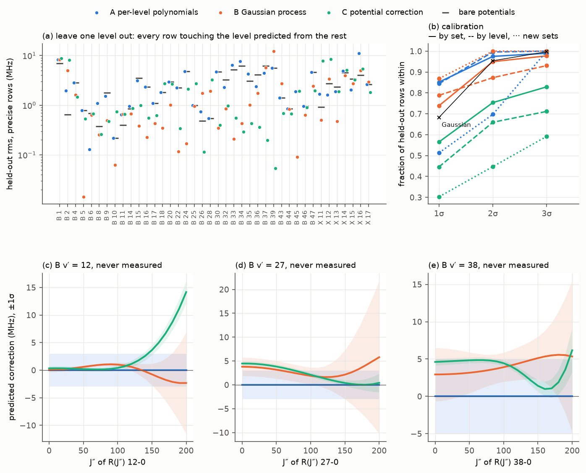

# Level corrections for unmeasured levels: a held-out bake-off

About 441 000 of the ~490 000 lines sit at levels that no one has measured. They carry the region values of
`lookup.uncertainty` (3–5 MHz) and no correction. This note asks whether a correction that shares
information across v and J would predict those levels better than the per-level polynomials do. It compares
three schemes on the same rows and the same held-out splits (`prototypes/bakeoff.py`; numbers in
`prototypes/out/bakeoff.json`).

## Rows

The rows are those of `prototypes/level_corrections_fit.py`, built with the same loop: ¹²⁷I₂ absolute
frequencies and inter-line intervals, r = observed − bare potentials of `i2spec2026n` (the published curves,
the MLR pair from v′ = 44 and v″ = 18, and no level corrections), σ_eff = hypot(σ, 0.3 MHz). The region is
**B v′ ≤ 50, X v″ ≤ 17**. X v″ = 18–25 is left out: its comb data are few, and the Orsay-atlas levels there
are a separate fit. That gives 1 085 rows from 49 sets: 879 absolute and 206 intervals. 398 rows are
"precise" (stated σ ≤ 0.3 MHz, and ≤ 0.5 MHz with the pressure allowance), the lines that may create a
correction. The main tables use the precise rows, because the other rows' own noise (Doppler-limited sets,
hot cells) is as large as the effect being tested.

## Schemes

- **A, per-level polynomials.** The fit of `level_corrections_fit.py`, unchanged: the degree rule, the
  5 MHz ridge prior, robust reweighting at 3σ, δX = 0 for v″ ≤ 10 and δB(0) = 0. In this region it gives
  47 levels. The predicted σ follows lookup's rule: a line within 15 in J of both of its levels' data gets
  0.3 MHz in quadrature with each level's covariance and discrepancy terms, recomputed in every training
  fold. Any other line gets the region value (3, 5, 8 or 15 MHz). A held-out level gets zero correction.
  An interval's σ is the two lines' σ in quadrature, because lookup has no rule for intervals.
- **B, Gaussian process.** f_B(v, y) and f_X(v, y) are independent GPs, with y = J(J+1)/10⁴. The kernel
  is a²·Matérn-5/2(v; ℓ_v)·SE(y; ℓ_y), plus a per-v independent SE-in-y term, plus a white term τ on each
  row. Every row is a linear functional of the two GPs, so the posterior is exact. The 11
  hyperparameters come from type-II maximum likelihood with analytic gradients, on the training rows of
  each fold. The robust reweighting is A's (σ inflated by |z|/3 above 3σ, 4 passes).
- **C, potential correction.** δV_s(R) = Σ c_k B_k(R) uses cubic B-splines over the data's R range:
  30 for B (2.63–5.16 Å) and 16 for X (2.40–3.08 Å). A centrifugal term δq_s(R)·J(J+1)ħ²/2μR² adds 8 and 6
  more. The B levels from v′ = 44 are built on the MLR, so they get δV_B + δV_ext. Level shifts are
  first-order (Hellmann–Feynman) ⟨ψ_vJ|δV|ψ_vJ⟩, from the model's B-spline eigenfunctions. The fit is
  robust ridge least squares: a second-difference penalty on each block, with its strength chosen by
  six-fold set-blocked cross-validation inside each training set, plus a weak 30 MHz ridge. σ is the
  ridge covariance scaled by χ², plus a discrepancy τ_C. τ_C is set so that the inner-CV residuals have
  median |z| = 0.674 (typically 0.32 MHz). The covariance alone is also reported ("C cov").

Splits: **leave one data set out** (49 folds); **leave one level out** (every A-corrected level that ≥ 2 rows
touch, 40 folds, all rows touching the level removed); and the **prediction test** of
`paper/analysis/predtest_2026k.py`. The prediction test trains on every set not in its `NEW` list and
predicts the 76 absolute rows of the 17 later sets (the same 76 rows as that script).

## Results (precise rows, MHz)

z = (observed − predicted) / predicted σ, where the predicted σ includes the row's own σ.
"bare" is the potentials with no correction.

| split | scheme | n | rms | median \|r\| | ≤ 1σ | ≤ 2σ | ≤ 3σ | rms z |
|---|---|---|---|---|---|---|---|---|
| set out | bare | 398 | 3.05 | 1.16 | | | | |
| | A | | **1.88** | 0.45 | 0.85 | 0.97 | 0.99 | 0.75 |
| | B | | 2.43 | **0.11** | 0.74 | 0.95 | 0.98 | 1.05 |
| | C | | 2.87 | 0.39 | 0.57 | 0.75 | 0.83 | 4.55 |
| level out | bare | 520 | 3.13 | 1.07 | | | | |
| | A | | 3.68 | 1.39 | 0.84 | 1.00 | 1.00 | 0.69 |
| | B | | **2.57** | **0.43** | 0.79 | 0.87 | 0.93 | 1.46 |
| | C | | 3.08 | 0.55 | 0.45 | 0.66 | 0.71 | 4.98 |
| new sets (all 76) | bare | 76 | 3.75 | 3.14 | | | | |
| | A | | 4.85 | 3.14 | 0.51 | 0.70 | 1.00 | 1.52 |
| | B | | **1.55** | **1.46** | 0.87 | 1.00 | 1.00 | 0.69 |
| | C | | 4.01 | 1.91 | 0.30 | 0.45 | 0.59 | 7.07 |

C's covariance alone is worse: rms z is 4.88, 5.22 and 7.79 on the three splits. On all 1 085 rows, set out,
rms and median are A 1.55/0.64, B 1.77/0.31, C 2.17/0.62, and bare 2.14/0.80. In sample, the precise rms
is A 0.35, B 0.13 and C 1.58.

Leave one level out, split by region (precise rows):

| levels held out | n | bare | A | B | C | B within 1/2/3σ, rms z |
|---|---|---|---|---|---|---|
| B v′ = 3–43 (visible) | 346 | 2.75 / 0.57 | 2.73 / 0.94 | 1.66 / **0.28** | **1.23** / 0.38 | 0.93 / 0.99 / 1.00, 0.50 |
| B v′ = 44–50 | 13 | 2.13 / 1.13 | 2.13 / 1.13 | **1.13** / 0.72 | 1.34 / 0.74 | 0.85 / 0.92 / 1.00, 0.98 |
| NIR: B v′ = 1–2, X v″ = 11–17 | 161 | 3.87 / 2.10 | 5.23 / 2.28 | 3.92 / **1.11** | 5.22 / 1.33 | 0.48 / 0.61 / 0.78, 2.51 |

(rms / median.) Figure 1(a) gives the result per level.

*Figure 1. (a) Held-out rms for each level when every row touching it is left out; the bars are the bare
potentials. (b) Fraction of held-out rows within 1, 2 and 3σ (precise rows; all 76 rows for the new sets).
(c–e) Each scheme's correction to R(J″) v′–0 for three levels no one has measured, ±1σ. A's is zero, with
3 or 5 MHz.*

### What the numbers show

- **When a data set is left out, A has the lowest rms and good calibration** (rms z 0.75). B has a
  typical error four times smaller (median 0.11 MHz against 0.45) but heavier tails. B's tails come from
  levels that a single set measures, which B must interpolate once that set is out. `nishiyama2024a`
  (B v′ = 39) is 12.2 MHz off, against 5.6 bare. `matsunaga2024a` (v′ = 45–50) is 13.8, against 7.9.
- **When a level is left out, A is worse than no correction** (3.68 against 3.13). A gives the held-out
  level zero, but its partner levels keep corrections fitted in combination with that level. This is the
  B v′ = 2 / X v″ = 11, 15, 16 coupling of `docs/design/parameter-sets.md`, i2spec2026m: X v″ = 16 goes to
  11 MHz. In the visible B levels, B's leave-one-level-out figures are 1.66 rms and 0.28 median, against
  2.73 and 0.94 for A. They are calibrated on the safe side: 93 % within 1σ, rms z 0.50. The worst B
  levels are B v′ = 39 (12.2 MHz; its neighbours v′ = 38 and 40–42 are unmeasured) and v′ = 37 (5.7).
- **The prediction test favours B**: 1.55 MHz rms and 0.69 rms z, against A's 4.85 and 1.52. Most of A's
  loss is B v′ = 24. Without `hsiao2013a`, the training data put v′ = 24 at J′ = 131 only (`yang2011a`),
  so A's constant misses `hauden2024a`'s 21 components at J′ = 48 by 7.6 MHz rms and `tanabe2022a` by 6.1.
  B takes the J dependence from the neighbouring levels: 1.47 and 1.42 MHz. (The repo's own 2026k test
  reached rms z 0.76 because 2026k still had hsiao2013a's J′ = 27 line at v′ = 24.)
- **Nothing predicts an unmeasured NIR level.** For X v″ = 11–17 and B v′ = 1–2, all three schemes are near
  the bare 3.9 MHz, and B is overconfident there (48 % within 1σ). The X levels there are reached only
  through v′ = 0–2 bands, and their corrections differ from level to level (the band correction of
  2026f exists for this reason).
- **C loses**, although its visible-B leave-one-level-out rms (1.23) is the lowest. A smooth first-order δV
  cannot follow the level-to-level structure: its in-sample rms is 1.58 MHz, against 0.13 for B. Its
  covariance under-covers by a factor of 5–8. Its high-J extrapolation runs away: B v′ = 12 reaches
  +14 MHz at J″ = 200 with a ±2 MHz band (Fig. 1c). The CV always chose the weakest smoothing on the grid,
  so the 30 MHz ridge is what regularises it. The basis size (30/16) was picked from 20/12, 30/16 and
  60/30 by these same held-out splits, which flatters C slightly. With 20/12 the leave-one-level-out rms
  is 4.1 and with 60/30 it is 5.4; leave one set out gives 3.1, 2.9 and 2.0.
- **B's hyperparameters are stable across the 89 set- and level-out folds**: a = 26–35 MHz (B) and 14–18 MHz (X),
  ℓ_v = 4.9–5.7, ℓ_y = 2.9–3.5 (y = 3.2 is J ≈ 180). The per-v term and τ go to their lower bounds in every
  fold. The data therefore see the corrections as smooth in v over about five levels, with no measurable
  independent v-to-v step, although the hyperfine table has such steps.

## Unmeasured levels

Each entry is the correction to R(J″) v′–0 (for X, X(v″, J) − X(0, J)), in MHz, as mean ± σ. A predicts 0
with the region value: ±3 MHz, or ±5 for v′ = 38.

| level | J″ | B (GP) | C (δV) | \|B − C\| |
|---|---|---|---|---|
| B v′ = 7 | 20 / 60 / 100 / 150 | +1.0±0.4 / +1.7±0.2 / +2.4±0.5 / +3.7±2.3 | +0.7±0.4 / +0.8±0.4 / +2.0±0.5 / +7.8±1.1 | 0.4 / 0.9 / 0.4 / 4.1 |
| B v′ = 12 | | +0.2±0.3 / +0.8±0.2 / +1.0±0.4 / −0.8±1.9 | +0.3±0.4 / +0.2±0.4 / +0.4±0.4 / +3.6±0.9 | 0.2 / 0.6 / 0.6 / 4.4 |
| B v′ = 19 | | −0.4±0.3 / −0.1±0.2 / +0.3±0.4 / +0.1±1.8 | +0.4±0.3 / −1.1±0.3 / −3.6±0.4 / −6.6±0.8 | 0.8 / 1.0 / 3.9 / 6.8 |
| B v′ = 27 | | +3.7±1.9 / +2.9±1.8 / +1.9±1.8 / +2.1±5.1 | +4.4±0.5 / +3.6±0.5 / +2.1±0.5 / +0.4±0.6 | 0.7 / 0.6 / 0.2 / 1.7 |
| B v′ = 38 | | +3.0±3.4 / +3.3±2.5 / +3.9±2.0 / +5.1±2.9 | +4.7±0.4 / +4.9±0.4 / +4.4±0.4 / +1.4±0.8 | 1.7 / 1.6 / 0.5 / 3.7 |
| X v″ = 5 | | −0.5±0.3 / +0.3±0.2 / +1.7±0.5 / +3.0±2.1 | −0.5±0.4 / −0.4±0.4 / +0.5±0.5 / +4.6±1.0 | 0.0 / 0.7 / 1.3 / 1.6 |
| X v″ = 8 | | −1.6±2.9 / +0.0±2.8 / +2.9±2.9 / +6.3±4.1 | −1.6±0.6 / −2.3±0.5 / −2.5±0.6 / +1.3±1.2 | 0.0 / 2.3 / 5.4 / 5.0 |

- **At J″ ≤ 60 the two level-sharing schemes agree to ≤ 1 MHz** at v′ = 7, 12, 19 and 27, and to 1.7 MHz at
  v′ = 38. Both put v′ = 27 and 38 at +3 to +5 MHz, where A gives zero. That is about 1σ of A's quoted
  3–5 MHz: the region value covers these levels, but the correction itself is known.
- **At J″ ≥ 100 they disagree by 2–7 MHz** (v′ = 19: GP +0.3, C −3.6 at J″ = 100). The GP's own σ grows
  there (1.8–5 MHz at J″ = 150), while C's does not. C's values beyond the data's J range are
  extrapolations of a centrifugal term that nothing constrains, and the spread between the schemes is the
  better guide.
- X v″ = 5 and 8 are A's reference levels (δX ≡ 0), but both other schemes find non-zero shifts relative to
  v″ = 0 at high J (+3 to +6 MHz at J = 150). The v″ ≤ 10 convention holds to about 1 MHz at low J.

## Recommendation

**Supplement, not replace.** Where a level has its own data, the per-level polynomials remain the best
tested choice: lowest rms when a whole set is left out, with calibration close to nominal. Where it has
none, A gives zero, which is no better than the bare potentials. In the visible B levels the GP halves the
error (median 0.94 → 0.28 MHz, rms 2.7 → 1.7) with honest or conservative σ. The prediction test also shows
the GP's value for levels measured over a narrow J range. The proposed layering:

1. Keep A (and the NIR band and Partie IV sections) for every level it corrects, within 15 in J of its data.
2. Add the GP posterior mean as the correction for B levels v′ = 3–50 that A does not correct, and for
   corrected levels beyond A's J coverage. For each such line, quote the GP predictive σ with a floor:
   σ = hypot(σ_GP, 0.5 MHz). The floor is set by the leave-one-level-out tails (B v′ = 37, 39).
3. Keep the region values in the NIR (X v″ = 11–17 through v′ = 0–2 and any v′ > 0 NIR band), where no scheme
   predicts an unmeasured level. Keep them also wherever the GP σ exceeds the region value.

With that layering, the per-line uncertainty of an unmeasured visible B level (lines to X v″ ≤ 10) would be:
0.5–0.7 MHz at J″ ≲ 100 when measured neighbours lie within about two in v′ (v′ = 7, 12, 19), 2–3.5 MHz when
the neighbours are sparse (v′ = 27, 38), and 2–5 MHz at J″ ≳ 150, where the level-sharing schemes disagree
by as much. At J ≤ 100 this is 3–6 times better than the present 3–5 MHz, and never worse. It has not
been tested for X v″ > 17 or B v′ > 50.

C, as built here, should not enter the model. It is worth revisiting only as a GP mean function (δV
fixes the smooth trend in v, the GP the rest), or with a second-order treatment of the MLR-built levels.

## Caveats

- A's interval σ (the two lines in quadrature) overstates the uncertainty of intervals within a band.
  This is part of why A's σ over-covers on all rows (rms z 0.59–0.65).
- The GP kernel form (Matérn-5/2 × SE, stationary in v) was chosen before the runs and not tuned. A
  non-stationary amplitude (NIR against visible) is the obvious next step for its NIR overconfidence.
- The robust reweighting down-weights a few lines in each fold, as A's does. Every held-out metric
  includes all held-out rows.
- Reproduce: `uv run --group research python prototypes/bakeoff.py` (≈ 30 s for the rows, then about
  2 minutes per scheme on 2 threads). Run `... bakeoff.py runB` for one scheme and `... bakeoff.py report`
  for the tables and figure.
