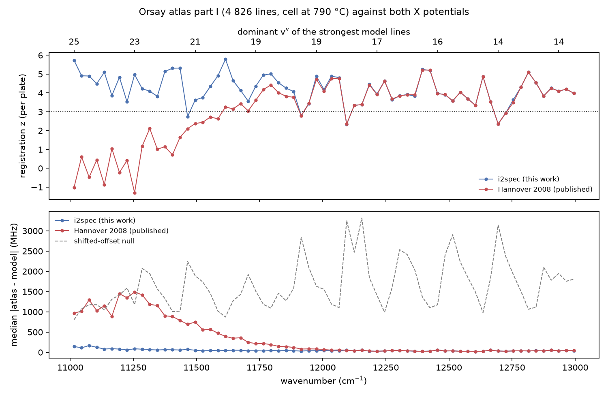
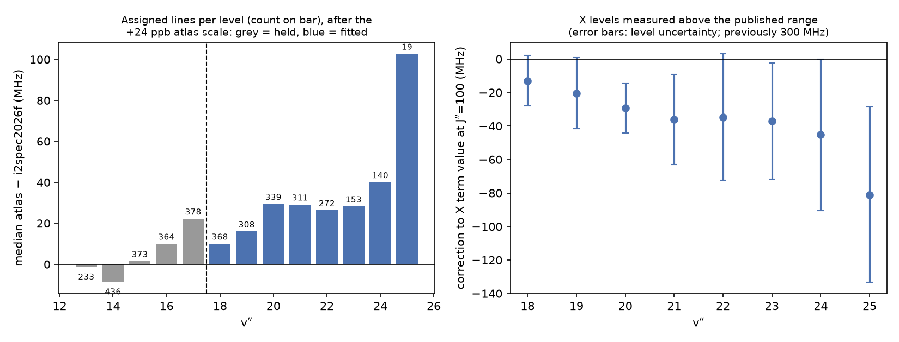
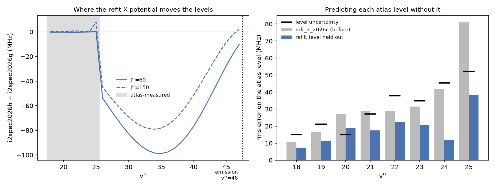

# The Orsay 11 000–14 000 cm⁻¹ atlas and the X levels v″ = 18–25

S. Gerstenkorn, J. Vergès and J. Chevillard, *Atlas du spectre d'absorption de la molécule d'iode,
11 000–14 000 cm⁻¹* (Laboratoire Aimé Cotton, CNRS II, Orsay, 1982). This note describes the atlas, how
its line tables were digitised, and what they add to the model: the first measurement of the X state
between v″ = 18 and v″ = 25, which the published potentials do not cover.

## The atlas

The atlas is a Fourier-transform absorption spectrum printed as traces at 1 cm⁻¹ per cm, 103 plates in
all, with a line table facing each plate. The tables list 8 699 lines in four columns:

| column | meaning |
|---|---|
| N | number of the tick marking the line on the trace |
| σ | vacuum wavenumber, cm⁻¹, to four decimals |
| ε | pointing uncertainty from noise alone, in 10⁻³ cm⁻¹ (mK) |
| I | depth of the line, relative to the continuum of its plate |

The spectrum was recorded in four parts, in a 30 cm cell inside a furnace:

| part | range (cm⁻¹) | cell T | cold point | pressure (torr) | S/N cut | lines |
|---|---|---|---|---|---|---|
| I | 11 000–13 000 | 790 °C | 80 °C | 15 | 7 | 4 826 |
| II | 12 900–13 390 | 500 °C | 60 °C | 5 | 3 | 1 152 |
| III | 13 350–13 920 | 500 °C | 60 °C | 5 | 5 | 1 604 |
| IV | 13 800–14 100 | 500 °C | 60 °C | 5 | 7 | 1 117 |

Part I is the valuable one. At 790 °C (1 063 K) the X levels far above the range of any other
measurement are populated, and at the atlas's own detection limit its lines come from v″ = 12–25.
Knöckel *et al.* (2004) give the atlas's uncertainty over 11 000–13 000 cm⁻¹ as 0.65 × 10⁻³ cm⁻¹ for
even J″ and 1.1 × 10⁻³ cm⁻¹ for odd J″; the median ε of part I is 1.4 × 10⁻³ cm⁻¹, or 42 MHz.

## Digitisation

All four parts were transcribed by hand from photographs of the table pages, one page at a time. The
table region of each photograph was cropped at full resolution (`prototypes/orsay_ocr.py crops`) and read
by eye; optical character recognition was tried and discarded, because page curvature and uneven
lighting corrupted about a third of the digits. Each page was checked on entry
(`prototypes/orsay_check.py`) against the structure of the tables: N consecutive, σ strictly increasing,
the integer part of σ consistent across a page, ε a single decimal, I a small integer. Readings that
needed a second look are listed with each page in `data/atlas_lines/orsay1982_pages*/second_looks.tsv`;
the atlas itself prints `***` for ten lines without ε.

The result is complete: 4 826 + 1 152 + 1 604 + 1 117 = 8 699 lines, each part matching the atlas's own
count (`data/atlas_lines/orsay1982_part{1,2,3,4}.csv`).

The overlaps between parts test the transcription:

- **Parts II/III and III/IV** overlap within one recording, printed twice. 45 of 45 and 363 of 364
  overlapping lines agree to the last digit. The comparison found three reading errors in part III (one
  digit of σ, and three depths shifted by one row), which are corrected; the remaining differences are
  four depths that differ in print between the two pages.
- **Parts I/II** are separate recordings. 111 of the 149 part II lines at 12 908–13 009 cm⁻¹ have a part I
  line within 5 × 10⁻³ cm⁻¹; the differences scatter as the two ε predict, about a mean offset of
  +2.0 ± 0.3 × 10⁻³ cm⁻¹, which is a calibration difference between the recordings (below).

Four errors in about 450 cross-checked lines is the error rate to expect where no overlap exists.
Part I has none within a recording, but a misread σ appears as an unassigned line or an outlying
residual in the fit below.

## Registration against the model

Before assignment, each 30 cm⁻¹ window of part I was compared with the strongest model lines at 1 063 K:
the median distance from each atlas line to the nearest model line, against a null distribution made by
shifting all atlas lines of the window by a common random offset (`prototypes/orsay_part1_test.py`).

| window (cm⁻¹) | dominant v″ | i2spec (MLR X) | Salumbides *et al.* 2008 | null |
|---|---|---|---|---|
| 11 000 | 25 | **144 MHz** (z = 5.7) | 963 MHz (z = −1.0) | 804 MHz |
| 11 210 | 23 | **59** (3.5) | 1 349 (0.4) | 1 589 |
| 11 420 | 22 | **58** (5.3) | 786 (1.6) | 1 016 |
| 11 630 | 20 | **51** (4.7) | 347 (3.2) | 1 271 |
| 11 840 | 19 | **45** (4.3) | 141 (3.8) | 1 273 |
| 12 050 | 18 | 41 (4.8) | 59 (4.8) | 1 105 |
| 12 260–13 000 | 17–13 | 33–52 | 33–54 | 1 100–3 100 |

Within the range of the 2008 fit (v″ ≤ 17) the two potentials are equivalent. Beyond it the 2008
potential loses registration progressively and has none from v″ ≈ 23, while the Morse/long-range X
potential of `docs/design/mlr-x.md` stays within 41–59 MHz to v″ ≈ 23. The floor of 40–60 MHz is the
atlas's own uncertainty.

## Assignment

Assignment (`prototypes/orsay_assign.py`) takes, for each atlas line, the strongest model line within
120 MHz. Against the full model list this is meaningless: at 200 model lines per cm⁻¹ almost any position
finds a line, and randomly shifted copies of the atlas were "assigned" nearly as often as the atlas
itself. The model list is therefore thinned, per 30 cm⁻¹ window, to 1.5 times the atlas's own line count
there, and the chance rate is measured with a null that keeps the number of atlas lines per cm⁻¹ but
scrambles their positions within each cm⁻¹. This assigns **3 700 lines, with about 150 (4 %) expected by
chance**: v′ = 0–2 → v″ = 13–25. v″ = 25 is marginal (16 lines against 2 by chance), and no level beyond
it is above chance. 1 349 R/P pairs that share an upper level agree with the model to a median of 41 MHz.

## Calibration

The atlas states that its wavenumbers are absolute, that Fourier-transform errors are proportional to
wavenumber, and that pointing and calibration together should stay within ±5 × 10⁻³ cm⁻¹ for the
strongest lines. Each part is therefore given one scale factor, fitted to the lines whose X and B levels
both lie within the J ranges of the frequency-comb-referenced level corrections
(`prototypes/orsay_calibration.py`):

| part | cell | lines used | scale | residual MAD |
|---|---|---|---|---|
| I | 790 °C | 1 370 | +20.8 ± 3.1 ppb | 45 MHz |
| II | 500 °C | 609 | +124.9 ± 5.1 ppb | 56 MHz |
| III | 500 °C | 473 | +142.6 ± 4.6 ppb | 47 MHz |
| IV | 500 °C | 259 | +142.4 ± 5.7 ppb | 42 MHz |

The three parts recorded under the same conditions agree with one another. Knöckel *et al.* (2004)
correct this atlas by −2.5 × 10⁻³ cm⁻¹ above 13 000 cm⁻¹; a scale of +140 ppb corresponds to
+1.9 × 10⁻³ cm⁻¹ there, so their correction is recovered independently. The level fit below, with its own
choice of anchor lines, finds +24 ppb for part I.

## X levels v″ = 18–25

The level fit (`prototypes/orsay_fit.py --free=18-25 --maxdeg=1`) adds to each X level v″ = 18–25 a
correction linear in J(J+1), with the part I scale fitted alongside; the levels v″ ≤ 17 are held at their
frequency-comb values. Linear, quadratic and cubic corrections give the same held-out error, so the
linear form is used. Freeing the J dependence of the upper levels B v′ = 0 and 1, which the atlas lines
reach to J′ ≈ 265, changes them by ±1 MHz and nothing else. After the fit, the sub-samples of each level
reached from v′ = 0, 1 and 2 agree to about 15 MHz.

| v″ | lines | ΔE at J″ = 100 | J″ covered | uncertainty |
|---|---|---|---|---|
| 18 | 368 | −13 MHz | 25–271 | 15 MHz |
| 19 | 308 | −20 | 35–249 | 21 |
| 20 | 339 | −29 | 39–233 | 15 |
| 21 | 311 | −36 | 43–247 | 27 |
| 22 | 272 | −35 | 37–265 | 38 |
| 23 | 153 | −37 | 51–205 | 35 |
| 24 | 140 | −45 | 37–183 | 45 |
| 25 | 19 | −81 | 37–74 | 52 |

The uncertainty is each level's leave-one-line-out rms with the atlas's per-line scatter removed in
quadrature, with a floor of 15 MHz set by the sub-sample agreement. The corrections are smooth, of one
sign and grow with v″: the MLR X potential was slightly too shallow just beyond its data, by 13–45 MHz up
to v″ = 24.

These corrections are part of the parameter set from `i2spec2026f` on. The uncertainty of lines to these
levels, within the J range of the atlas, is the level's value above (15–52 MHz); before the atlas it was
estimated at 300 MHz.

## Refit of the X potential

`prototypes/mlr_x_atlas.py` refits the MLR X potential to the corrected levels v″ = 18–25, together with
its own levels v″ ≤ 17, the emission-measured levels v″ = 48, 53 and 54, and the long-range constants.
The atlas levels go from 33 MHz to 16.5 MHz rms. Refitting with one level left out and predicting it
does better than the previous potential for every level (7–38 MHz against 11–81 MHz) and falls within
the level's uncertainty for seven of eight. Between v″ = 26 and 47, where nothing is measured, the refit
changes the levels smoothly by up to −100 MHz; this is within the uncertainty quoted there. The refitted
potential (`mlr_x_2026d`) is used from `i2spec2026h` on.

The atlas cannot test the extrapolation beyond v″ = 25: no tabulated line comes from a higher level.

## Other volumes of the series

The same laboratory published atlases of other ranges. Estimated with the same thinned model list:

| volume (cm⁻¹) | lower levels | new information |
|---|---|---|
| 14 000–15 600 | v″ = 4–10 | none: inside the range of the 2008 fit, and covered by the Salami & Ross atlas |
| 14 800–20 000 | v″ = 0–8 | a third independent calibration of this region |
| 19 700–20 035 | v″ = 0 → v′ = 51–62, and lines closer to dissociation | the region where the model is least certain (B v′ > 50) |

The 19 700–20 035 cm⁻¹ volume is the most useful next source: it is a line list independent of any
model, in the region just below the B dissociation limit. It is now transcribed: `orsay-atlas-19700-20035.md`.
