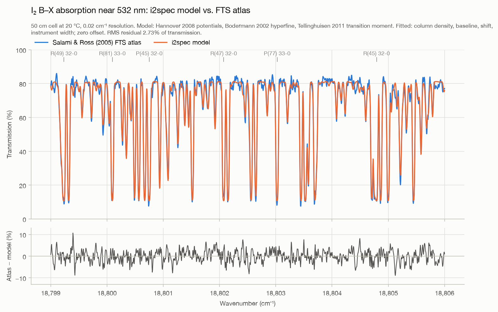
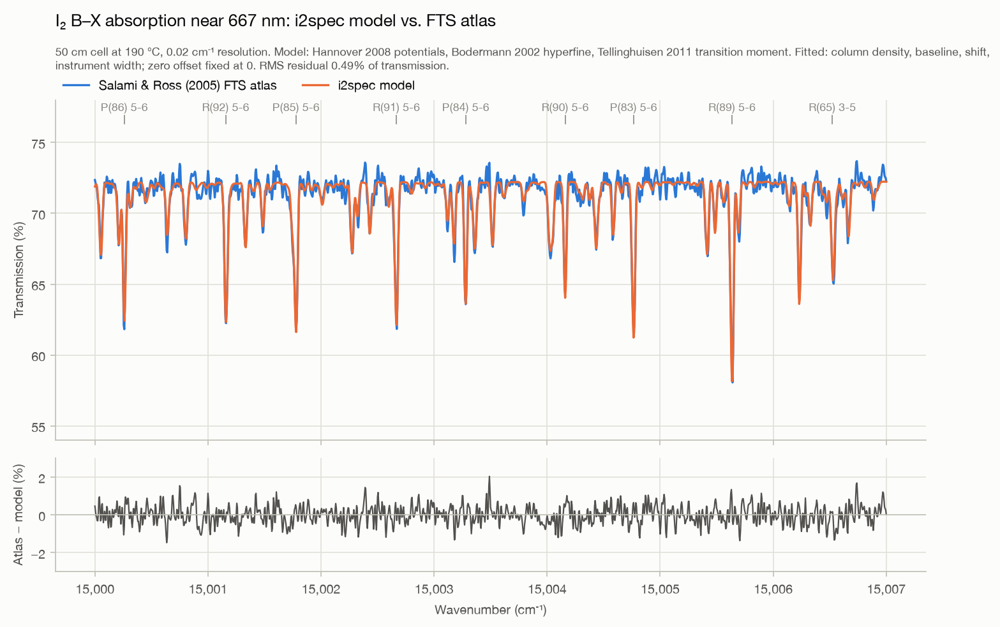
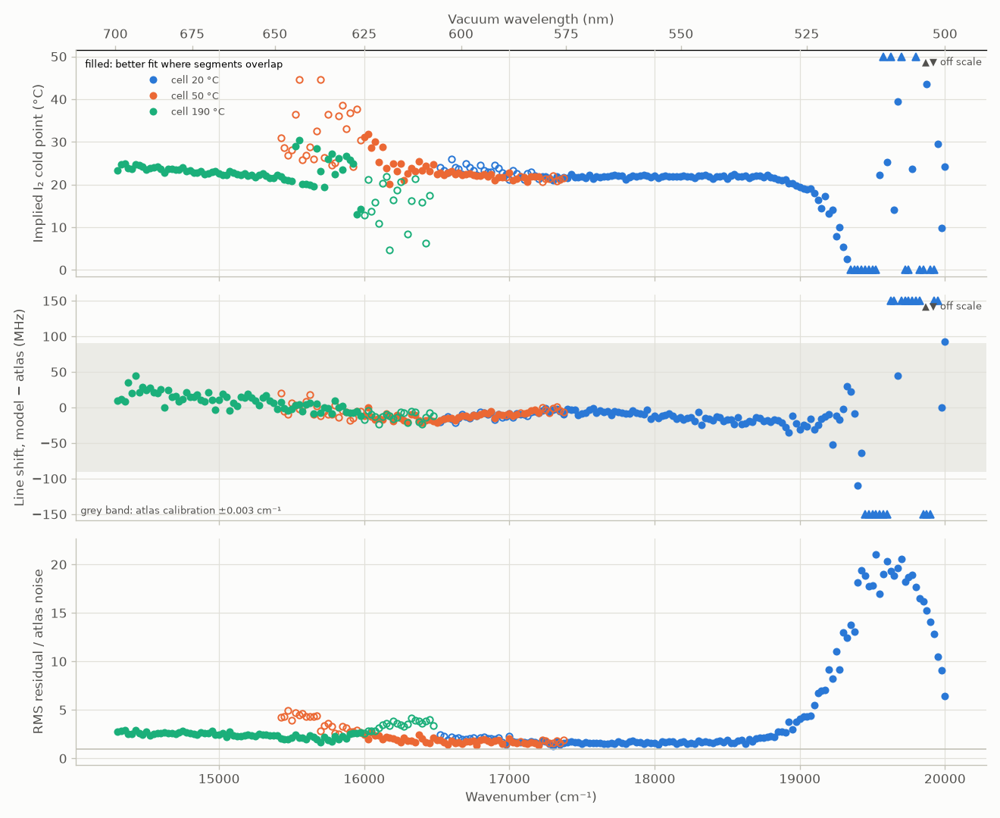
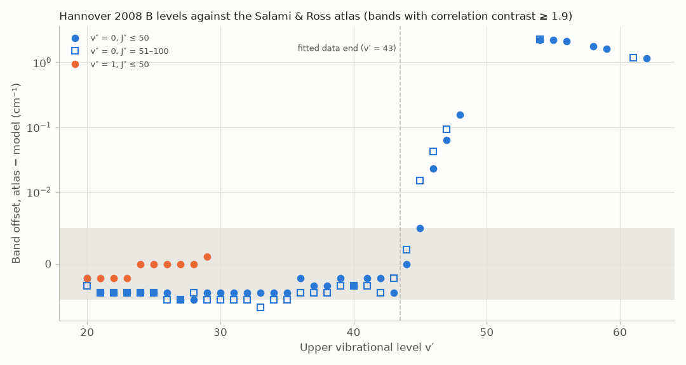
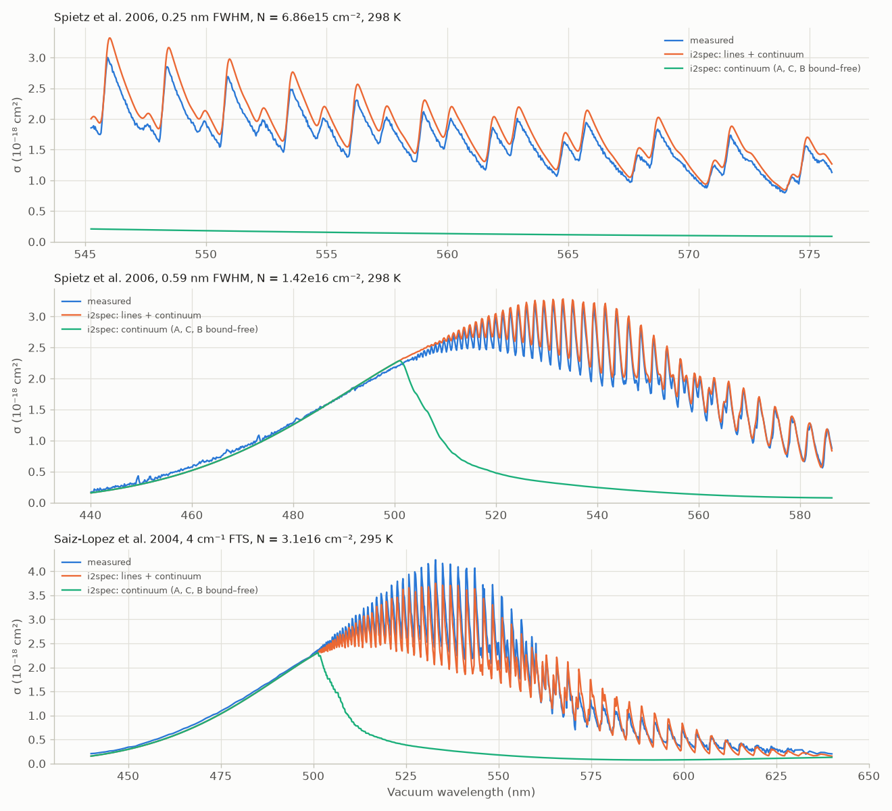

# Spectrum validation (M3)

Two parts:
* **Relative intensities and line shapes**, against the Salami & Ross FTS atlas. The column density and baseline are fitted.
* **Absolute cross sections**, against Spietz 2006, Saiz-Lopez 2004 and Tellinghuisen 2011, with nothing fitted.

## Salami & Ross atlas

*2026-09-15. Scripts: `prototypes/compare_salami_ross.py` (fit) and `prototypes/plot_salami_ross.py` (figures). Inputs: `intensity-inputs.md`.*

## What is compared

**Model.**
* Hannover 2008 potentials, with X and B on a shared grid.
* J-dependent transition matrix elements ⟨v′J′|μ(R)|v″J″⟩, with μ(R) from Tellinghuisen 2011 eq. (10).
* Hönl–London factors, nuclear-spin weights, and the partition function at the cell temperature.
* A Doppler profile for every hyperfine component. Components come from the Bodermann 2002 formulae (ΔJ = 0 blocks).
* Transmission exp(−σN), then convolved with a Gaussian instrument function.
* Only lines with S ≥ 10⁻²⁶ cm are included.

**Data.** Salami & Ross 2005: 50 cm cell, instrumental resolution 0.02 cm⁻¹, 0.005 cm⁻¹ sampling.

| Window (cm⁻¹) | λ | Atlas segment | Model T | Lines in model | Dominant bands |
|---|---|---|---|---|---|
| 18 799–18 806 | 532 nm | cell at 20 °C | 293.15 K | 418 | 32–0, 33–0 (v″ = 0, plus hot bands) |
| 15 000–15 007 | 667 nm | cell at 190 °C | 463.15 K | 1 244 | 5–6, 3–5 (hot bands, v″ = 3–6) |

**Free parameters.**
* Column density, a linear baseline and an additive zero offset. The atlas records neither the I₂ pressure nor an absolute zero of transmission.
* A wavenumber shift and the instrument FWHM.
* In the 667 nm window every line is weak (under 20% deep). There the zero offset, baseline and column density are degenerate, so the offset is fixed at 0.

## Results

| With hyperfine structure | 532 nm (20 °C) | 667 nm (190 °C) |
|---|---|---|
| Deepest line | 91% | 19% |
| RMS residual (transmission) | **2.73%** | **0.49%** |
| Atlas noise (second differences) | 1.2% | 0.20% |
| Mean residual vs. absorption depth | none (≤ 0.6% in every depth class) | none |
| Implied I₂ pressure (cold point) | **31 Pa (21.7 °C)** | **33 Pa (22.5 °C)** |
| Wavenumber shift, model vs. atlas | −14 MHz | +5 MHz |
| Instrument FWHM | 0.0147 cm⁻¹ | 0.0138 cm⁻¹ |
| Zero offset | +0.107 (fitted) | fixed at 0 |
| *RMS residual without hyperfine structure* | 4.57% (and the fit turns unphysical) | 0.51% |

**Interpretation.**
* **Absolute intensities agree between the two segments.** The implied I₂ pressures agree within 7% (31 vs. 33 Pa), even though the cell body was at 20 °C in one recording and 190 °C in the other, and different bands dominate: v″ = 0 at 293 K versus v″ = 3–6 at 463 K. The pressure is set by the sidearm, presumably at room temperature both times. The agreement tests three things together: the populations (partition function and Boltzmann factors), the hot-band Franck–Condon factors, and μ(R) over a different R range. The caveat: the atlas doesn't record the sidearm temperature.
* **Line positions** agree within the atlas calibration of ±0.003 cm⁻¹ (±90 MHz): −14 MHz and +5 MHz.
* **Line shapes and relative intensities:**
  * the residual shows no dependence on absorption depth;
  * the instrument width is consistent between segments (0.0147 and 0.0138 cm⁻¹) and with an FTS at a nominal 0.02 cm⁻¹ resolution;
  * at 532 nm, hyperfine structure is essential.
* **About 2.5× the noise remains in both windows**, so there is still some systematic misfit. Candidates:
  * the Gaussian stand-in for the FTS instrument function (no sinc sidelobes);
  * weak lines below the strength cutoff, especially at 190 °C where there are many hot bands;
  * baseline structure;
  * details of the hyperfine patterns.

**The instrument function is not the cause of the residual.** Refits with FTS instrument functions (`--ils=` option):

| Instrument function | 532 nm RMS | 667 nm RMS | Implied cold points (532 / 667 nm) |
|---|---|---|---|
| Gaussian | 2.73% | 0.49% | 21.7 / 22.5 °C |
| sinc (unapodized) | 3.49%, with a −9.8% bias at the baseline from sidelobe ringing | 0.52% | 21.6 / 21.6 °C |
| sinc² (triangular apodization) | 2.79% | 0.48% | 21.6 / 23.1 °C |

So the atlas was evidently apodized, and a Gaussian represents it as well as sinc² does. The implied I₂ pressure is robust to the choice.

### Scan across the whole atlas

*Scripts:*
* `prototypes/scan_salami_ross.py`: 307 window fits, each 4 cm⁻¹ wide, one every 25 cm⁻¹.
* `prototypes/plot_scan_salami_ross.py`: the figure.
* `prototypes/band_shifts_salami_ross.py`: per-band offsets.

**How each window is fitted.**
* Each window is fitted once for every atlas segment that covers it, at that segment's cell temperature.
* Free parameters: the column density, a linear baseline, the zero offset (only where lines are more than 30% deep), the shift and a Gaussian instrument width.
* Lines with S ≥ 10⁻²² cm get hyperfine structure. The continuum is included.

**Findings.**
1. **Which segment the atlas contains.** Where segments overlap, the better fit shows the splice points:
   * the 190 °C recording below about 15 950 cm⁻¹;
   * 50 °C from there to about 17 400 cm⁻¹;
   * 20 °C above that.
2. **Relative band intensities hold over 16 500–18 800 cm⁻¹.** In this part of the 20 °C segment the implied cold point stays at 21.0–22.5 °C, while v′ runs from about 15 to 40 and v″ from 0 to 3. That makes the column constant to ±7% full range (standard deviation 2.4%). Above 18 850 cm⁻¹ the implied cold point falls, to 19.4 °C at 19 000 cm⁻¹, as hot bands to the misplaced v′ > 44 levels enter. An earlier version of this note said ±5% over 16 500–19 000 cm⁻¹, which overstated the agreement.
3. **At the nominal temperature, the implied cold point drifts across the 190 °C segment,** from 24.5 °C at 14 300 cm⁻¹ to 21 °C at 15 400 cm⁻¹, about 30% in column. The bands there start from v″ ≈ 4–10, so their strength depends steeply on T. A one-off check refitted 12 windows (with `scan_salami_ross.fit_window`) at four temperatures:

   | Model T | Cold-point slope (°C per 1000 cm⁻¹) | Spread | Mean rms |
   |---|---|---|---|
   | 430 K | −2.84 | 1.02 °C | 0.475% |
   | 463 K (nominal) | −1.39 | 0.55 °C | 0.451% |
   | **500 K** | **−0.04** | **0.33 °C** | **0.442%** |
   | 540 K | +1.20 | 0.60 °C | 0.449% |

   * At 500 K the drift vanishes and the fit improves.
   * The implied cold point there, about 21 °C, matches the 20 °C segments (21.5–22 °C).
   * So the absorbing gas was probably near 500 K, about 37 K above the stated cell-body temperature.
   * An error in μ(R) at large R could mimic part of this, because the hot bands probe larger R. This segment alone cannot separate the two.
4. **Line positions agree with the atlas calibration up to about 19 300 cm⁻¹.** The window shift (model − atlas) drifts smoothly from +20 MHz at 14 300 cm⁻¹ to −25 MHz at 19 000 cm⁻¹. That stays inside the ±90 MHz (±0.003 cm⁻¹) calibration, and the slope matches an atlas scale error of 8×10⁻⁸.
5. **In the good range the residuals are 1.5–2.5× the atlas noise.**
6. **Above 19 100 cm⁻¹ the fits fail,** with rms up to 20× the noise, because of the B levels above v′ = 44 (table below).

**Per-band offsets, atlas − model (cm⁻¹).** Each band's lines are shifted rigidly against the atlas; entries are J″ ≤ 50 / J″ = 51–100. The method uses hyperfine-free positions, so offsets below about 0.005 cm⁻¹ are not significant.

| v′ | v″ = 0 | v″ = 1 (J″ ≤ 50) |
|---|---|---|
| 20–43 | −0.002 to −0.005 | −0.002 to +0.003 |
| 44 | 0.000 / +0.002 | +0.004 |
| 45 | +0.005 / +0.015 | +0.009 |
| 46 | +0.023 / +0.042 | +0.024 |
| 47 | +0.064 / +0.093 | +0.067 |
| 48 | +0.157 / +0.213 | +0.157 |
| 49 | +0.354 / +0.544 | |
| 50 | +0.672 | |
| 51 | +1.233 | |
| 52 | +1.812 | |
| 53 | +2.160 / +2.215 | |
| 54 | +2.242 / +2.258 | +2.246 |
| 55 | +2.244 / +2.203 | +2.243 |
| 56 | +2.135 / +2.080 | |
| 57 | +1.986 / +1.691 | |
| 58 | +1.777 / +1.685 | |
| 59 | +1.640 / +1.479 | |
| 60 | +1.427 / +1.350 | |
| 61 | +1.236 / +1.179 | |
| 62 | +1.162 | |

**How reliable the table is.**
* The correlation contrast falls from about 3 at v′ ≤ 44 to 1.3–2.5 above v′ = 49, so v′ = 50–52 are less certain.
* The smooth progression, and the matching v″ = 1 values at v′ = 54–55, support the rest.

**What it means.**
* v″ = 0 and v″ = 1 give the same offsets, so the error is in the B levels. For v′ ≥ 45 the model's B levels are too low, by up to 2.25 cm⁻¹ (67 GHz).
* At v′ = 45–49 the offset grows with J, so the rotational constants B_v are also off.
* BIPM's ¹²⁷I₂ R(98) 58-1 at 515 nm confirms it independently: it is 1.38 cm⁻¹ from the model (`bipm-hyperfine-tables.md`).
* Tellinghuisen (2011) found the same: the published quantal potential "behaves anomalously … above the high-υ limit of the data (υ = 43)".
* **The published Hannover potentials are valid only up to v′ ≈ 44.** Phase B needs data at high v′. The atlas itself provides it, since its bands reach v′ ≈ 62.

## Absolute cross sections, with no free parameters

*2026-09-15. Scripts: `prototypes/compare_cross_sections.py` (spectra) and `prototypes/check_continuum.py` (continuum and spot values). Dataset conditions: `cross-section-data.md`. Continuum model: `continuum-model.md` §10.*

**Model.**
* Lines: every B–X line with S ≥ 10⁻²⁷ cm at some T in 200–600 K, up to v′ = 62.
* Line shape: Voigt, with a 0.24 cm⁻¹ Lorentzian FWHM for about 1 bar of N₂ or air.
* Continuum: A←X, C←X, and B←X above the line list.
* Each data set's own conditions: its stated column N, temperature and resolution, applied as σ_app = −ln(ILS ⊗ e^(−σN))/N with a Gaussian instrument function.
* Nothing is fitted.

| Data set | Range (nm) | Model / data | Stated scale uncertainty |
|---|---|---|---|
| Spietz 2006, 0.25 nm | 545–576 | 1.08–1.11 per 10 nm (mean 1.102, scatter 3%) | ±4% (transferred from 500 nm) |
| Spietz 2006, 0.59 nm | 490–586 | 1.01–1.06 | ±3% |
| Spietz 2006, 0.59 nm | 440–490 | 0.87–0.99 | window-deposit region |
| Saiz-Lopez 2004, 4 cm⁻¹ | 440–640 | 0.78–1.16, band-structured | ±12% |

| Spot value | i2spec | Reference |
|---|---|---|
| σ(500.0 nm air), 0.58 nm, 298 K | 2.252×10⁻¹⁸ cm² (ε = 589) | Spietz 2.186(21): **+3.0%**. Tellinghuisen room-T ε = 590(4): −0.2% |
| ε(500.2 nm, 35 °C) | 587.0 | Tellinghuisen 587.4(8) |
| ε(436 nm, 298 K) | 31.1 | Tellinghuisen 31.0(4) |
| Continuum / Tellinghuisen Table II, 405–495 nm | 0.995–0.999 | he claims ±0.5% |
| Lines + continuum / Tellinghuisen Table II, 505–645 nm, smoothed over 4 nm | 0.994–1.033 | model against model |

**Interpretation.**
1. **i2spec is on Tellinghuisen's absolute scale.** The continuum agrees within 0.5%, the band envelopes within 3%, and σ(500 nm) within 0.2% of his room-temperature value.
   * This is expected, because the lines use his μ(R) and the continuum uses his potentials.
   * It also shows that our partition function, Franck–Condon factors and line list add no scale error at the percent level.
2. **Spietz and Tellinghuisen disagree by 3% at 500 nm:** 572(6) against 590(4) L mol⁻¹ cm⁻¹, each stated to about 1%. The model inherits Tellinghuisen's scale. On Spietz's σ(500) anchor it would scale down by 3%. Then:
   * the 0.59 nm spectrum would agree to within −2 to +3% at 490–586 nm;
   * the 0.25 nm spectrum would still be 7% high. That spectrum sits 5.4% below the 0.59 nm spectrum where the two overlap (`cross-section-data.md`), and its concentration was transferred from 500 nm with 4% uncertainty. So the two Spietz spectra disagree with each other by about as much as the 0.25 nm one disagrees with the model.
3. **Saturation is negligible under 1 bar of N₂.** For the 0.25 nm spectrum, σ_app at the stated column differs from its N → 0 limit by only 0.1%. Without pressure broadening the difference would be 3%. In this regime the shape of the instrument function cannot change band means.
4. **The Saiz-Lopez residual follows problems in that data set.**
   * Smoothed to 0.25 nm, it is 1.26–1.29 × Spietz at 545–560 nm but 0.88–0.93 × at 570–580 nm. That is the same step near 560 nm that Spietz reported.
   * Tellinghuisen found it "uniformly about 10 L mol⁻¹ cm⁻¹" above his 35 °C spectrum at 400–485 nm, which matches our 0.83–0.97 there.
5. **For the global fit (stage 5), absolute data need scale nuisance parameters.** The best anchors are Spietz σ(500) and Tellinghuisen ε(500.2 nm). They differ by 3%, and that difference is the present floor on absolute accuracy.

## Next checks

1. **Strength cutoff:** lower it below 10⁻²⁶ cm in hot windows.
2. **More windows:** done (the scan above). Follow-ups:
   * extract line positions at v′ > 44 from the atlas as observations for Phase B;
   * treat the cell temperature of the 190 °C segment as a fit parameter (it comes out near 500 K).
3. **Absolute intensities:** done above. The 3% Spietz–Tellinghuisen scale difference is still open, and Tellinghuisen's measured spectra are not public; only his Table II is.
4. **Speed:** building a line list takes 90–110 s, because every J is diagonalized. Line lists are cached per window in `prototypes/out/`.
